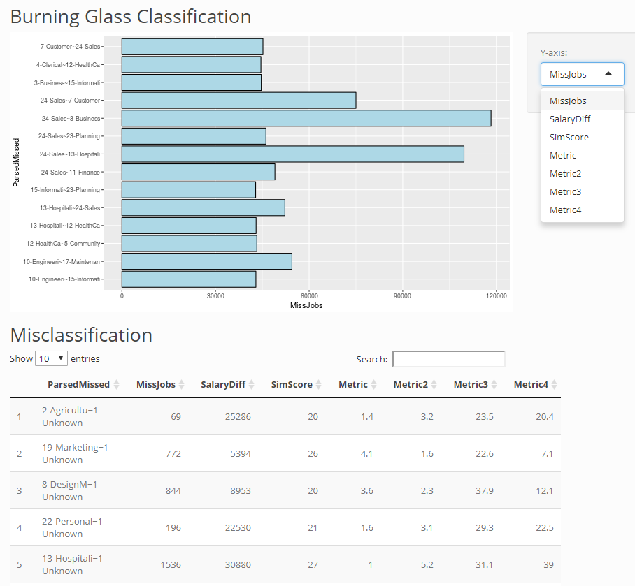

```{r echo=FALSE, results='hide', message=FALSE}
require(ggplot2)

require(captioner)

library(ggthemes)
library(dplyr)
library(tidyr)
library(directlabels)
library(ggrepel)
library(extrafont)
library(stringr)
library(Amelia)
library(corrgram)
library(corrplot)
require(gridExtra)
require(ggmosaic)
require(lsr)
library(zoo)
library(caTools)
library(randomForest)
library(e1071)
library(purrr)
library(caret)
library(stats)
library(reshape2)
library(scales)


figs <- captioner(prefix="Figure")
tbls <- captioner(prefix="Table")

knitr::opts_chunk$set(warning=FALSE, message=FALSE, echo = FALSE, dev = "cairo_pdf")

```

```{r eval=FALSE}
# To export just the R code script.
library(knitr)
purl("BurningGlass.Rmd")
```


\pagenumbering{gobble}

\newpage

\pagenumbering{arabic}

\tableofcontents

\newpage

# __Executive Summary__

Burning Glass Technologies is a Boston based analytics software company that analyzes hundreds of millions of
job postings to provide insight into labor market patterns. They would like to replace their current
method of parsing job postings in order to determine jobs titles with a less cumbersome machine-learning technique.
In order to evaluate this new method of classification they need a way to evaluate the parsed (former method) and
tagged (new machine learning method) pairs of job titles. This method must be flexible enough to scale from
the highest job classification level (career area) of which there are only 26 different classifications, to the
lowest level, of which there are over 1,800 resulting in a matrix of over 3 million pairs. Heatmaps were used to
evaluate misclassification based on number of jobs, average salary and similarity score. In addition a method
whereby a large number of parsed-tagged pair could be evaluated was proposed in which each parsed tagged pair
could be quickly sorted based on these metrics. This would allow the most misclassified pairs to be quickly
identified. As the consequences for misclassifying career areas that are similar is greater than for those
that are dissimilar a metric was created to reflect this. This scaled metric gives a greater weighting to job careers
that share a low similarity index. Three additional metrics, of various weightings,  were also created. 
A proof of concept was deployed for career areas as an interactive web app created with Shiny-R.

\newpage

# __Introduction__

Burning Glass Technologies is a Boston based  analytics software company that was founded in 1999 and analyzes 
hundreds of millions  of job postings to provide insight into labor market patterns. 
They use artificial intelligence technology to provide a better 
understanding of the  patterns of job placement, the skills and experiences required to land jobs, and 
which jobs are most in demand. 

Burning Glass Technologies controls several patents relating to data extraction, information interpretation, behavioral 
profile generation, entity matching, and machine learning (Bloomberg, 2017). Clients of their data, analytics, software and 
services include enterprises, recruiters, educational institutions and government agencies.

In order to facilitate analysis, one important task that Burning Glass must do is to classify job postings into a predefined 
set of job titles. This is challenging as the volume of data is ever increasing, and technology continuously brings new jobs 
into the marketplace. Currently they perform this task programmatically, however this is cumbersome as it requires a great deal of
code making it difficult to maintain. Burning Glass would like to replace this with a scalable machine-learning technique to
classify the complete text of each job posting into one job group. Burning Glass maintains their own job classification hierarchy
which roughly corresponds to job titles used by O\*NET. O\*NET is an addition to the Standard Occupational
Classification (SOC)$^2$ system created by the U.S. Bureau of Labor Statistics (Peterson et al, 2001).

The use of machine learning technology in business is predicted to double by the end of 2018 (Deloitte, 2017). Machine Learning
has recently been used to classify job titles with techniques such as using Lingo3G, a proprietary clustering library based on the 
Lingo clustering algorithm (Zhou et al., 2016), K-Nearest Neighbors (Zhu et al., 2016), and NLP and Neural Based Ensemble 
Classifiers as part of Google's Cloud Jobs API (Posse, 2018). 

Burning Glass is in the initial stages of developing a machine learning technique to replace their current programmatic model
used to classify job titles. A confusion matrix comparing current job title classifications to those produced by the new model
will be produced for each level of the job hierarchy. The purpose of this report is to develop an automatic scalable way
in which to evaluate how well the new model works by considering factors beyond simple accuracy such as the number of jobs posted.


# __Data__

The top level of the job classification hierarchy contains 26 groups known as career areas. 
The results of the machine learning model's classification of career areas are contained in an excel spreadsheet 
having three tabs. The first sheet shows the number of job postings and average salary of 
each level (Table \ref{tab:CareerAreas}).


<!-- _`r tbls("CareerAreas","The number of job postings and their salaries for each career area level analyzed.")`_ -->
\begin{table}[h]
\caption{The number of job postings and their salaries for each career area level analyzed.}\label{tab:CareerAreas}
\centering
\scalebox{0.8}{
\begin{tabular}{llrr}
  \hline
Career Area ID & Career Area Name & \# Postings & Average Salary \\ 
  \hline
1  &  na  &  1,464,581  &  \$59,667   \\
2  &  Agriculture, Horticulture, \& the Outdoors  &  69,136  &  \$34,381   \\
3  &  Business Management and Operations  &  1,276,268  &  \$52,091   \\
4  &  Clerical and Administrative  &  840,655  &  \$37,449   \\
5  &  Community and Social Services  &  291,823  &  \$40,568   \\
6  &  Construction, Extraction, and Architecture  &  362,782  &  \$52,540   \\
7  &  Customer and Client Support  &  594,779  &  \$34,203   \\
8  &  Design, Media, and Writing  &  211,103  &  \$50,714   \\
9  &  Education and Training  &  680,686  &  \$52,529   \\
10  &  Engineering  &  641,002  &  \$68,499   \\
11  &  Finance  &  1,534,712  &  \$55,837   \\
12  &  Health Care including Nursing  &  4,324,717  &  \$69,959   \\
13  &  Hospitality, Food, and Tourism  &  1,536,123  &  \$28,787   \\
14  &  Human Resources  &  434,244  &  \$52,964   \\
15  &  Information Technology  &  2,041,033  &  \$88,694   \\
16  &  Law, Compliance, and Public Safety  &  402,694  &  \$47,707   \\
17  &  Maintenance, Repair, and Installation  &  618,770  &  \$42,191   \\
18  &  Manufacturing and Production  &  527,389  &  \$39,582   \\
19  &  Marketing and Public Relations  &  386,248  &  \$65,061   \\
21  &  Performing Arts  &  6,555  &  \$51,153   \\
22  &  Personal Services  &  98,215  &  \$37,137   \\
23  &  Planning and Analysis  &  389,783  &  \$75,491   \\
24  &  Sales  &  2,884,958  &  \$43,380   \\
25  &  Science and Research  &  136,953  &  \$60,412   \\
26  &  Transportation  &  1,598,384  &  \$55,944   \\
   \hline
\end{tabular}
}
\end{table}


The second tab of the spreadsheet shows the distribution of the confusion matrix results. For each parsed career area (the 
original classification) and newly tagged career area (machine algorithm produced career area) the percentage of
correctly classified jobs is shown. Table \ref{tab:CaMatrix} shows some lines from this table\footnote{For example we can see  that for career area 2, 
which is Agriculture, Horticulture, and the Outdoors the distributions shows 0.715,  meaning 71.5\% of jobs previously classified in this career 
area were classified correctly using the machine learning algorithm.  3.9\% were classified into career area 3, which is Business Management and Operations.}. 

The third tab of the data shows a similarity index. For each combination of career area a percent similarity score is given.

<!-- _`r tbls("CaMatrix","The distribution of Parsed to Tagged Career Areas. This shows the accuracy of each career area prediction")`_ -->
\begin{table}[h]
\caption{The distribution of Parsed to Tagged Career Areas. This shows the accuracy of each career area prediction.}\label{tab:CaMatrix}
\centering
\scalebox{0.8}{
\begin{tabular}{rrr}
  \hline
Parsed Career Area ID & Tagged Career Area ID & Distribution \\ 
  \hline
2   &   1   &   0.001   \\
2   &   2   &   0.715   \\
2   &   3   &   0.039   \\
2   &   4   &   0.009   \\
2   &   5   &   0.001   \\
3   &   1   &   0.003   \\
3   &   2   &   0.002   \\
3   &   3   &   0.811   \\
3   &   4   &   0.014   \\
3   &   5   &   0.003   \\
   \hline
\end{tabular}
}
\end{table}


\newpage

# __Exploratory Data Analysis__

## __Data Cleaning__

R and R-Studio Version 1.0.136 were used exclusively in this report. All R code is shown in Appendix A.
Each tab was loaded into R as a separate data frame. 
The structure of each file was examined to show that each column was correctly identified as a factor or numeric.

```{r, echo=FALSE, message=FALSE, fig.align="center"}
# set working directory
setwd("/Users/alexeimarcilio/Desktop/portfolio/marketing")
# load three csv files
job.count <- read.csv("CareerAreaJobs.csv")
job.matrix <- read.csv("CareerAreaMatrix.csv")
job.sim <- read.csv("CareerAreaSim.csv")
# Remove all non numeric characters and remove or add factors
# job count
job.count$Postings <- gsub("[^0-9\\.]", "", job.count$Postings) 
job.count$Postings <- as.numeric(job.count$Postings)
job.count$Avg_Salary <- gsub("[^0-9\\.]", "", job.count$Avg_Salary) 
job.count$Avg_Salary <- as.numeric(job.count$Avg_Salary)
job.count$CareerAreaId <- as.numeric(job.count$CareerAreaId)
# job matrix
job.matrix$CareerArea_Parsed <- gsub("[^0-9\\.]", "", job.matrix$CareerArea_Parsed) 
job.matrix$CareerArea_Tagged <- gsub("[^0-9\\.]", "", job.matrix$CareerArea_Tagged) 
job.matrix$CareerArea_Parsed <- as.numeric(job.matrix$CareerArea_Parsed)
job.matrix$CareerArea_Tagged <- as.numeric(job.matrix$CareerArea_Tagged)
# job similarity
job.sim$SimScore <- gsub("[^0-9\\.]", "", job.sim$SimScore) 
job.sim$CareerArea_id <- as.numeric(job.sim$CareerArea_id)
job.sim$paired_CareerArea_id <- as.numeric(job.sim$paired_CareerArea_id)
# Update files field names
colnames(job.count) <- c('Parsed','Name','Count','AvgSalary')
colnames(job.matrix) <- c('Parsed','Tagged','Distribution')
colnames(job.sim) <- c('Parsed','Tagged','SimScore','Rank')
# 
# View(job.matrix)
```


```{r, echo=FALSE, message=FALSE, fig.align="center", results='hide'}
str(job.count)
str(job.matrix)
str(job.sim)
```

Missing values were checked for each file. `r figs("Missing",display="cite")` shows that there were missing values for the  
summary file as well as the matrix file. The missing values in the summary file were for a large group of missing job classifications
representing over 1.4 million jobs. This value will be removed. 
In addition in the correlation matrix there are tagged career area ids that have corresponding null parsed values.
These initially had the values of "NULL" in the spreadsheet but were removed when all characters were removed for the ID fields.

```{r, echo=FALSE, message=FALSE, fig.align="center"}

# df <- 
#   r_data_frame(
#   n = 30,
#   id,
#   race,
#   age,
#   sex,
#   hour,
#   iq,
#   height,
#   died,
#   Scoring = rnorm,
#   Smoker = valid
#   ) %>%
#   r_na(prob=.4)


ggplot_missing <- function(x, title){
  
  x %>% 
    is.na %>%
    melt %>%
    ggplot(data = .,
           aes(x = Var2,
               y = Var1)) +
    geom_raster(aes(fill = value)) +
    scale_fill_solarized(name = "",
                    labels = c("Present","Missing")) +
    theme_tufte() + 
    theme(axis.text.x  = element_text(angle=45, vjust=0.5)) + 
    ggtitle(title) +
    theme(text=element_text(size=10, family="Tw Cen MT")) +
    labs(x = "Variables in Dataset",
         y = "Rows / observations")
}
# scale_fill_calc
# scale_fill_stata
job.count.miss <- ggplot_missing(job.count, "Career Area Counts and Salaries")
job.matrix.miss <- ggplot_missing(job.matrix, "Career Area Matrix Distribtution")
job.sim.miss <- ggplot_missing(job.sim, "Career Area Similarities")


grid.arrange(job.matrix.miss, job.sim.miss, job.count.miss,  ncol=2)

```
_`r figs("Missing","A check of missing values in the three data sets.")`_


```{r, echo=FALSE, message=FALSE, fig.align="center"}
# remove rows with missing values
job.count <- na.omit(job.count)

```

The missing values in the matrix file do not seem to correspond to only one Tagged ID. For example for the parsed career area ID
of 6 it seems to correspond to 7 as the value 7 is missing, however for the tagged ID of 6 both 1 and 2 are missing.
These null values will not be removed but replaced with the value of 99.

```{r, echo=FALSE, message=FALSE, fig.align="center"}
job.matrix$Tagged <- 
  job.matrix$Tagged %>% replace_na(99)

```


We check that all distribution values for each career area add up to 1. The following R code produces no
rows showing that the distributions all sum to 1.

```{r, echo=TRUE, message=FALSE, fig.align="center", results='hide'}

job.matrix  %>% 
  select(Parsed, Distribution) %>% 
  group_by(Parsed) %>% 
  summarise(CareerArea = sum(Distribution)) %>% 
  filter(CareerArea != 1)


```


## __Visualization__

A heat map of a matrix of parsed to tagged career area IDs shows that the highest correlations are between
the parsed value and the same predicted values. That is to be expected (`r figs("DistHeatMap",display="cite")`).
There's quite a range however among the accuracy of the predictions. There is no career area ID of 20, as indicated
by the blank line. The excel tab containing the career area names skips the ID of 20. This is because this career area ID
is reserved for military positions and these are not generally posted (Gaurav, 2018).

```{r, echo=FALSE, message=FALSE, fig.align="center"}
job.matrix %>%
  filter(Tagged != 99) %>% 
  ggplot(aes(Parsed,Tagged)) +
  geom_tile(aes(fill=Distribution), color="white", size = 1) +
  scale_fill_gradientn(colours=c("light blue","dark blue","green")) +
  theme_tufte() + 
  theme(text=element_text(size=13, family="Tw Cen MT")) 
```
_`r figs("DistHeatMap","A heat map of the correlation between the parsed and tagged career areas.")`_

`r figs("JobBarPlot",display="cite")` shows a plot of the distribution values for each career area prediction, with the percent 
correlation shown. Transportation has the highest distribution value for the parsed vs. tagged value, in other words the machine
learning algorithm best predicted this career area. Health Care, Personal Services, and Finance were all predicted with greater than
87% accuracy. 

The worst predicted category was Performing Arts (57%). Design Media and Writing as well as Community and Social Services
were also among those career areas with the lowest prediction rates. Perhaps this indicates that less technical careers are more
difficult to predict as there seems to be a trend from more scientifically rigorous careers such as IT, Law and Finance having higher 
scores than the social sciences and the arts, such as Human Resources and Community and Social Services having lower scores.

```{r, echo=FALSE, message=FALSE, fig.align="center"}

job.matrix %>%
  filter(Parsed == Tagged) %>% 
  left_join(job.count, by = c("Tagged" = "Parsed")) %>% 
  select(Name, Distribution) %>% 
  ggplot(aes(x=reorder(Name, Distribution), y=Distribution, label=sprintf("%2.0f", round(Distribution * 100, digits = 2)))) +
  geom_bar(aes(x=reorder(Name, Distribution),y=Distribution, fill=Distribution),stat="identity") +
  geom_text(size = 2.5, position = position_nudge(y = +0.025)) +
  geom_tile(aes(fill=Distribution), color="white", size = 1) +
  scale_fill_distiller(palette="RdBu", direction=1) +
  theme_tufte() + 
  xlab("Career Areas") + 
  coord_flip() +
  theme(text=element_text(size=13, family="Tw Cen MT")) 

```

_`r figs("JobBarPlot","A bar plot of the distribution values of each career area prediction.")`_

The preceding chart showed the correlation between tagged and parsed job areas without any consideration for the number
of jobs in each category. This does not take into consideration that prediction accuracy is more important for 
job categories with a larger share of the overall number of positions. Therefore the matrix distribution
will be weighted by the proportion of jobs in the respective category. The overall goal should be to  correctly classify
the largest proportion of jobs. To this end a new column is created that shows the total number of misclassified jobs
for each category.

The formula used here is simply:

$$(1-Distribution) \times \#Positions $$
`r figs("JobBarPlotWeight",display="cite")` shows a different story than the previous chart. When total misclassified jobs
are shown Sales career area has the most with about 695,000. This is more than double the next nearest category Health Care.
IT has the third most misclassified positions.


```{r, echo=FALSE, message=FALSE, fig.align="center"}

job.matrix %>%
  filter(Parsed == Tagged) %>% 
  left_join(job.count, by = c("Tagged" = "Parsed")) %>% 
  mutate(Miss_Jobs = round((1 - Distribution) * Count)) %>% 
  select(Name, Distribution, Miss_Jobs) %>% 
  ggplot(aes(x=reorder(Name, Miss_Jobs), y=Miss_Jobs, label=format(Miss_Jobs, big.mark="," ))) +
  geom_bar(aes(x=reorder(Name, Miss_Jobs),y=Miss_Jobs, fill=Miss_Jobs),stat="identity") +
  # geom_text(size = 2.5, position = position_dodge(width = 0.9), check_overlap = FALSE) +
  annotate(geom="text", x = 24, y = 650000, label = '695k',color='white', size = 2.5) + 
  annotate(geom="text", x = 22, y = 230000, label = '259k',color='black', size = 2.5) + 
  scale_y_continuous("Misclassified Jobs",breaks=c(0,200000,400000,600000),labels =  c("0", "200,000", "400,000", "600,000")) +
  # geom_tile(aes(fill=Miss_Jobs), color="white", size = 1) +
  scale_fill_distiller(palette="RdBu", direction=-1) +
  # scale_fill_gradientn(colours=c("green","light blue","dark blue")) +
  # scale_fill_distiller(palette ="RdBu") +
  theme_tufte() + 
  theme(legend.position="none") +
  xlab("Career Areas") + 
  coord_flip() +
  theme(text=element_text(size=13, family="Tw Cen MT")) 

```

_`r figs("JobBarPlotWeight","A bar plot of the number of misclassfied jobs by career area.")`_

# __Classifier Evaluation__

At a high level we can see that the career area of Sales is the most misclassified based on total number of misclassified 
positions. Now we must dig deeper. In order to determine which specific parsed and tagged job classifications are of most 
concern we require an application or interface having the following requirements:

\begin{enumerate}

\item The most miscorrelated combinations of parsed and tagged job categories should be shown. 
This can be weighted by total number of jobs misclassified, total salary, and similarity index for now. 
The method of producing these results should be flexible enough to add a new weighting relatively simply.
\item The method by which these results are shown should be flexible enough so that different job classification 
levels could be analyzed without much additional effort. Currently career area levels are analyzed, 
however the method described here should be flexible enough to work with all job classification levels 
including the lowest level in which more than 3 million combinations would be analyzed.
\item The method should be interactive so that certain thresholds could be selected. 
As there will be potentially millions of combinations to examine the top 5\% could be displayed with the option of 
selecting more or less. 
\end{enumerate}


```{r}

new.table <-
job.matrix %>% 
  left_join(job.count, by = c("Parsed" = "Parsed"))
# Add job.count (# jobs and avg. salary info) to the table.
new.table <-
new.table %>% 
  left_join(select(job.count, Parsed, Name), by = c("Tagged" = "Parsed"))

# Add similarity scores
new.table <-
new.table %>% 
  left_join(select(job.sim, Parsed, Tagged, SimScore), by = c("Parsed" = "Parsed", "Tagged" = "Tagged"))
# Change SimScore to continuous
new.table$SimScore <- as.numeric(new.table$SimScore)
  
colnames(new.table)[colnames(new.table)=="Name.x"] <- "Parsed.Name"
colnames(new.table)[colnames(new.table)=="Name.y"] <- "Tagged.Name"

# Update missing values to unknown
upd_miss <- function(x) {
  x <- as.character(x)
  if (is.na(x)) {
    return("Unknown")
  } else {
    return(x)
  }
}

new.table$Tagged.Name <- sapply(new.table$Tagged.Name, upd_miss)

# add missed jobs column
new.table$missed.jobs <- 0
# add a missed salary column - total missed salary (# missed jobs * avg salary)
new.table$missed.salary <- 0


# for parsed = tagged distribution shows the proportion of correcly classified,
# otherwise incorrectly classified

# Update dataframe
for (row in 1:nrow(new.table)) {
  parsed <- new.table[row,"Parsed"]
  tagged <- new.table[row,"Tagged"]
  dist <- new.table[row,"Distribution"]
  count <- new.table[row,"Count"]
  salary <- new.table[row,"AvgSalary"]
  # update missed jobs accordingly
  if (parsed == tagged) {
    new.table[row,"missed.jobs"] <- round((1 - dist) * count )
    new.table[row,"missed.salary"] <- round((1 - dist) * count * salary)
  } else {
    new.table[row,"missed.jobs"] <- round(dist * count)
    new.table[row,"missed.salary"] <- round(dist * count * salary)
  }
}


```


```{r, echo=FALSE, message=FALSE, fig.align="center"}
# Interactive Heat Map


new.table %>%
  filter(Tagged != Parsed) %>% 
  ggplot(aes(Parsed.Name,Tagged.Name)) +
  coord_fixed() +
  geom_tile(aes(fill=missed.jobs), color="white", size = 1) +
  # scale_fill_gradient(low="green", high="red") +
  scale_fill_distiller(palette="RdBu", direction=-1, labels=c("0","30,000","60,000","90,000","120,000")) +
  # scale_fill_gradientn(colours=c("yellow", "green","blue","orange")) +
  theme_tufte() + 
  xlab("Parsed Category") +
  ylab("Tagged Category") +
  theme(text=element_text(size=10, family="Tw Cen MT")) +
  theme(axis.text.x = element_text(angle = 90, hjust = 1, vjust = 0)) +
  labs(fill='No. Missing Jobs') 

```
_`r figs("JobBarPlotMisJobsDetail","A heat map of the number of misclassfied jobs by career area and where the misclassification is occuring ")`_


`r figs("JobBarPlotMisJobsDetail",display="cite")` shows a heatmap which displays where the most number of jobs 
are misclassified. The parsed category and the distribution of the misclassified results are shown. An interesting
pattern is immediately seem. There are three parsed to tagged mappings that are very highly miscorrelated. 
These are Sales with Business Management and Operations, followed by Sales with Hospitality, Food and Tourism which
both have over 90,000 misclassified jobs. This is followed by Sales vs. Customer and Client Support. All the other
misclassified pairs have much lower values, under 50,000 jobs.


In `r figs("JobBarPlotMisJobsDetailSal",display="cite")` a similar heatmap is shown except this time the number of jobs is
weighted by the average salary. In other words the metric analyses is the total combined salary of all the misclassified 
positions. The results here are slightly different. The highest misclassified pair is still Sales and Business Management
and Operations, followed by Sales vs. Hospitality, Food and Tourism, yet in this case Information Technology is now show
to be misclassified to a higher degree with Planning and Analysis, Finance and Business Management and Operations.

```{r}
new.table %>%
  filter(Tagged != Parsed) %>% 
  ggplot(aes(Parsed.Name,Tagged.Name)) +
  coord_fixed() +
  geom_tile(aes(fill=missed.salary), color="white", size = 1) +
  scale_fill_distiller(palette="RdBu", direction=-1, labels=c("0","$1b","$2b","$3b","$4b","$5b")) +
  # scale_fill_gradientn(colours=c("light blue","dark blue","green")) +
  theme_tufte() + 
  xlab("Parsed Category") +
  ylab("Tagged Category") +
  theme(text=element_text(size=10, family="Tw Cen MT")) +
  theme(axis.text.x = element_text(angle = 90, hjust = 1, vjust = 0)) + 
  labs(fill='Total Missed Salary') 
```

_`r figs("JobBarPlotMisJobsDetailSal","A heat map of the number of misclassfied jobs weighted by average salary by career area and where the misclassification is occuring.")`_

Lastly we can look at the SimScore. This is the similarity index of each Parsed-Tagged combination. The results
show more of a range than the previous heatmaps (`r figs("SimScore",display="cite")`). The most similar career areas
are Science and Research and Planning and Analysis, Unknown with Business Management and Operations, Engineering and
Science and Research, and Planning and Analysis with Science and Research. The least similar are Performing Arts with IT, 
Clerical and Administrative, and Marketing and Public Relations.

Performing Arts and Clerical and Administration, and Performing Arts and Finance are the least similar career areas.
Intuitively this makes sense. 

```{r}
new.table %>%
  filter(Tagged != Parsed) %>% 
  ggplot(aes(Parsed.Name,Tagged.Name)) +
  coord_fixed() +
  geom_tile(aes(fill=SimScore), color="white", size = 1) +
  scale_fill_distiller(palette="RdBu", direction=1) +
  # scale_fill_gradientn(colours=c("light blue","dark blue","green")) +
  theme_tufte() + 
  xlab("Parsed Category") +
  ylab("Tagged Category") +
  theme(text=element_text(size=10, family="Tw Cen MT")) +
  theme(axis.text.x = element_text(angle = 90, hjust = 1, vjust = 0)) +
  labs(fill='Similarity Score') 
```
_`r figs("SimScore","A heat map of the similarity scores between tagged and parsed career areas.")`_

A heat map is a good way to visualize a limited set of categories, but it becomes impractical when dealing
with a large matrix. A method is required that would allow for the immediate identification of 
the largest parsed vs. tagged values for much larger data sets. This method must work for 
comparison of the lowest level of job classifications where there are more than 
1,800 job categories resulting in over 3 million comparisons.

In order to facilitate this the following steps were taken:

\begin{enumerate}
\item Transform the data to create one column from each Parsed-Tagged combination. For example $3Bus-24Sal$ would be the
new field representing Business Management and Operations vs. Sales. 
\item Each of these new fields plus the three metric examined so far will be assigned to a new dataframe.
\item An interactive barplot chart will be created using Shiny-R (R-Studio, 2017)) in order to make it interactive.
The top 10, 20 and 50 misclassified combinations will be able to be selected as well as any metric. 
This will allow for scaling up to many more job categories.
\end{enumerate}

`r figs("Shiny",display="cite")` shows the website created with Shiny-R displayed on an iPhone. It allows 
for some interactivity, the user can select the y-axis value to see the the top 10 misclassified
Parsed-Tagged combinations based on number of jobs, salary, or similarity.

```{r, out.width = "300px", out.height="600px", echo=FALSE, message=FALSE,  fig.align="center"}



```

_`r figs("Shiny","The Shiny-R misclassification app displayed on Internet Explorer. ")`_

The website this application is here:

$https://alexei.shinyapps.io/burningglass/$


```{r}
# 
# View(web.table)
# 
# str(web.table)

web.table <-
new.table %>%
  filter(Tagged != Parsed)

#Remove NA values
web.table <- na.omit(web.table)

# Add Parsed~Tagged Column
web.table$ParTag <-
  gsub(" ","",paste0(web.table$Parsed, '-', 
                     substr(web.table$Parsed.Name,1,9), '~', web.table$Tagged, '-', 
                     substr(web.table$Tagged.Name,1,9) ))


web.table$ParTag <- gsub(",","",web.table$ParTag)


web.table$MissJobs1.100 <- rescale(web.table$missed.jobs, to=c(1,100))
web.table$AvgSal1.100 <- rescale(web.table$AvgSalary, to=c(1,100))

web.table$SimScore1.100 <- 1 - rescale(web.table$SimScore, to = c(1,100))
 
web.table$MissMetric <- rescale(web.table$MissJobs1.100 * web.table$AvgSal1.100 * 
                                  web.table$SimScore1.100, to=c(1,100)) 

web.table$SimScore1.100 <- rescale(web.table$SimScore, to = c(1,100))

web.table$MissMetric <- rescale((web.table$MissJobs1.100 * web.table$AvgSal1.100 * 
                                  (100 - web.table$SimScore)^4),to = c(1,100))


```


## __Classification Metric__

The previous solution is not yet satisfactory as the consequences of misclassifying career areas with
high similarity are much greater than an incorrect identification when the similarity score is low.
Therefore a metric was created and added to the Shiny-R site. This metric provides a weighted and scaled
way in which to better assess a classification.

The metric was derived using the following formula:

$MissMetric = (1 - Similarity Score^4) \times Scaled[1\space to \space 100](Average \space Salary) \times Scaled[1\space to \space 100](Missing Jobs)$

The MissMetric score was then scaled from 1 to 100.

```{r}

web.table %>%
  filter(Tagged != Parsed) %>% 
  ggplot(aes(Parsed.Name,Tagged.Name)) +
  coord_fixed() +
  geom_tile(aes(fill=MissMetric), color="white", size = 1) +
  scale_fill_distiller(palette="RdBu", direction=-1) +
  # scale_fill_gradientn(colours=c("light blue","dark blue","green")) +
  theme_tufte() + 
  xlab("Parsed Category") +
  ylab("Tagged Category") +
  theme(text=element_text(size=10, family="Tw Cen MT")) +
  theme(axis.text.x = element_text(angle = 90, hjust = 1, vjust = 0)) +
  labs(fill='Missed Metric') 

```
_`r figs("MissMetricHeatMap","A heat map of the missed metric scores between tagged and parsed career areas.")`_

A heat map of this new missed metric clearly highlights the combinations that have high scores  
`r figs("MissMetricHeatMap",display="cite")`.Information Technology vs. Business Management and
Operations has a high metric number. The metric is also high for Finance vs. Healthcare.


## __Consideration of other Metrics__

There's no standard way in which to evaluate a large matrix of classifications. The metric outlined here is one 
proposed method, however the heatmap shows that only a few career areas combinations have high metric scores.
In order to highlight more combinations and to allow us to better evaluate different metrics three new
metrics will be proposed and visualized. 

In our first metric the average salary was considered, however a better metric might include a difference between
the tagged and parsed career area salaries. A large difference would be more serious than a small one, especially for
the job seeker. 

The three new metrics are:

$Scaled[1\space to \space 100]MissMetric2 = (100 - Similarity Score)^4 \times Scaled[1\space to \space 100](Average \space Salary \space Difference) \times Scaled[1\space to \space 100](Missing Jobs)$

$Scaled[1\space to \space 100]MissMetric3 = (100 - Similarity Score)^2 \times log_{10}(Average \space Salary \space Difference) \times log_{10}(Missing Jobs)$

$Scaled[1\space to \space 100]MissMetric4 = 5 \times (100 - Similarity Score) \times Scaled[1\space to \space 100](Average \space Salary \space Difference) \times log_{10}(Missing Jobs)$


```{r}
# web.table$MissMetric2 <- rescale((web.table$MissJobs1.100 * web.table$AvgSal1.100 * 
#                                   (1 - web.table$SimScore)^4),to = c(1,100))

# Create a dataframe of ID and Salary look ups
TaggedSalary <- data.frame(unique(web.table[,c(1,6)]))
colnames(TaggedSalary) <- c("Tagged","AvgTaggedSalary")
unknownSalary <- c(1, 59667)
TaggedSalary <- rbind(TaggedSalary,unknownSalary)


# Add tagged Salary
web.table <- merge(x = web.table, y = TaggedSalary, by = "Tagged", all.x = TRUE)

# Create absolute salary difference column
web.table$SalaryDiff <- abs(web.table$AvgTaggedSalary - web.table$AvgSalary)

#Create scaled SalaryDifference column
web.table$SalaryDiff1.100 <- rescale(web.table$SalaryDiff, to=c(1,100))

# Create Metric2
web.table$MissMetric2 <- rescale((web.table$MissJobs1.100 * web.table$SalaryDiff1.100 * 
                                  (100 - web.table$SimScore)^4),to = c(1,100))

# Create Metric3
web.table$MissMetric3 <- rescale((log10(web.table$missed.jobs) * log10(web.table$SalaryDiff) * 
                                  (100 - web.table$SimScore)^4),to = c(1,100))

# Create Metric4
web.table$MissMetric4 <- (100 - web.table$SimScore)*5 * log10(web.table$missed.jobs) * web.table$SalaryDiff1.100
web.table$MissMetric4 <- rescale(web.table$MissMetric4, to=c(1,100))
# View(web.table)

```

`r figs("MissMetric2",display="cite")`, `r figs("MissMetric3",display="cite")` and 
`r figs("MissMetric4",display="cite")` show heatmaps for these new metrics. The third and forth metrics show 
a more even distribution of numbers. Also they both indicate that Information Technology and it's relationship
to other career areas scores highly on these metrics.


```{r}

web.table %>%
  filter(Tagged != Parsed) %>% 
  ggplot(aes(Parsed.Name,Tagged.Name)) +
  coord_fixed() +
  geom_tile(aes(fill=MissMetric2), color="white", size = 1) +
  scale_fill_distiller(palette="RdBu", direction=-1) +
  # scale_fill_gradientn(colours=c("light blue","dark blue","green")) +
  theme_tufte() + 
  xlab("Parsed Category") +
  ylab("Tagged Category") +
  theme(text=element_text(size=10, family="Tw Cen MT")) +
  theme(axis.text.x = element_text(angle = 90, hjust = 1, vjust = 0)) +
  labs(fill='Missed Metric 2') 

```
_`r figs("MissMetric2","A heat map of the second metric, Missed Metric 2, between tagged and parsed career areas.")`_

```{r}
web.table %>%
  filter(Tagged != Parsed) %>% 
  ggplot(aes(Parsed.Name,Tagged.Name)) +
  coord_fixed() +
  geom_tile(aes(fill=MissMetric3), color="white", size = 1) +
  scale_fill_distiller(palette="RdBu", direction=-1) +
  # scale_fill_gradientn(colours=c("light blue","dark blue","green")) +
  theme_tufte() + 
  xlab("Parsed Category") +
  ylab("Tagged Category") +
  theme(text=element_text(size=10, family="Tw Cen MT")) +
  theme(axis.text.x = element_text(angle = 90, hjust = 1, vjust = 0)) +
  labs(fill='Missed Metric 3') 

```

_`r figs("MissMetric3","A heat map of the third metric, Missed Metric 3, between tagged and parsed career areas.")`_

```{r}
web.table %>%
  filter(Tagged != Parsed) %>% 
  ggplot(aes(Parsed.Name,Tagged.Name)) +
  coord_fixed() +
  geom_tile(aes(fill=MissMetric4), color="white", size = 1) +
  scale_fill_distiller(palette="RdBu", direction=-1) +
  # scale_fill_gradientn(colours=c("light blue","dark blue","green")) +
  theme_tufte() + 
  xlab("Parsed Category") +
  ylab("Tagged Category") +
  theme(text=element_text(size=10, family="Tw Cen MT")) +
  theme(axis.text.x = element_text(angle = 90, hjust = 1, vjust = 0)) +
  labs(fill='Missed Metric 4') 
```
_`r figs("MissMetric4","A heat map of the fourth metric, Missed Metric 4, between tagged and parsed career areas.")`_

# __Conclusions__

Classifying jobs titles presents several challenges. There are hundreds of millions of job postings, and new
jobs are constantly being added which makes using a industry standard of job titles such as O\*NET difficult. 
Analyzing the resultant confusion matrix is not a trivial task. It's not enough to simply report classifications, as
there are greater consequences of classifying jobs that are dissimilar than those that are closely related. 
This paper presented one solution to this challenge, the creating of a weighted metric along with a web based
application in which users could easily find misclassified pairs.

Further work could involve adding additional metrics, conditionally formatting specific measures, and adding 
interactive web page elements allowing users to test factor weightings in real time.


\newpage

# __References__

Bloomberg (2017). Retrieved April 06, 2018, from https://www.bloomberg.com/research/stocks/private/snapshot.asp?privcapId=206979023

Deloitte Global 2017 TMT Predictions: Mobile Machine Learning expected to expand, helping to transform society | Deloitte China | 
Press release. (2017, January 22). Retrieved February 10, 2018, from 
https://www2.deloitte.com/cn/en/pages/about-deloitte/articles/pr-deloitte-tmt-2017-predictions.html

Gaurav, M., (2018, Apr 10). Personal interview.

Peterson et al. (2001). Understanding work using the occupational information network (o*net): implications for practice 
and research. Personnel Psychology, 54: 451-492. 

Posse, C. (2018). Cloud Jobs API: Machine learning goes to work on job search and discovery | Google Cloud Big 
Data and Machine Learning Blog  |  Google Cloud. Retrieved April 06, 2018, from
https://cloud.google.com/blog/big-data/2016/11/cloud-jobs-api-machine-learning-goes-to-work-on-job-search-and-discovery

R-Studio. (2017). Shiny. Retrieved April 14, 2018, from https://shiny.rstudio.com/

Zhou, W., Zhu, Y., Javed, F., Rahman, M., Balaji, J., & Mcnair, M. (2016). 
Quantifying skill relevance to job titles. 2016 IEEE International Conference on Big Data (Big Data). 
doi:10.1109/bigdata.2016.7840761

Yun Zhu, Faizan Javed, Ozgur Ozturk, (2016). Document Embedding Strategies for Job Title Classification, 
Proceedings of the Thirtieth International Florida Artificial Intelligence Research Society Conference.


\newpage

# __Appendix__

## __Exploratory Data Analysis__

### __Data Cleaning__


```{r, echo=TRUE, eval=FALSE, message=FALSE, fig.align="center"}
# set working directory
setwd("C:/Users/Alexei/OneDrive/Merrimack/Capstone/data")
# load three csv files
job.count <- read.csv("CareerAreaJobs.csv")
job.matrix <- read.csv("CareerAreaMatrix.csv")
job.sim <- read.csv("CareerAreaSim.csv")
# Remove all non numeric characters and remove or add factors
# job count
job.count$Postings <- gsub("[^0-9\\.]", "", job.count$Postings) 
job.count$Postings <- as.numeric(job.count$Postings)
job.count$Avg_Salary <- gsub("[^0-9\\.]", "", job.count$Avg_Salary) 
job.count$Avg_Salary <- as.numeric(job.count$Avg_Salary)
job.count$CareerAreaId <- as.numeric(job.count$CareerAreaId)
# job matrix
job.matrix$CareerArea_Parsed <- gsub("[^0-9\\.]", "", job.matrix$CareerArea_Parsed) 
job.matrix$CareerArea_Tagged <- gsub("[^0-9\\.]", "", job.matrix$CareerArea_Tagged) 
job.matrix$CareerArea_Parsed <- as.numeric(job.matrix$CareerArea_Parsed)
job.matrix$CareerArea_Tagged <- as.numeric(job.matrix$CareerArea_Tagged)
# job similarity
job.sim$SimScore <- gsub("[^0-9\\.]", "", job.sim$SimScore) 
job.sim$CareerArea_id <- as.numeric(job.sim$CareerArea_id)
job.sim$paired_CareerArea_id <- as.numeric(job.sim$paired_CareerArea_id)
# Update files field names
colnames(job.count) <- c('Parsed','Name','Count','AvgSalary')
colnames(job.matrix) <- c('Parsed','Tagged','Distribution')
colnames(job.sim) <- c('Parsed','Tagged','SimScore','Rank')
# 
# View(job.matrix)
```


```{r, echo=TRUE, eval=FALSE, message=FALSE, fig.align="center", results='hide'}
str(job.count)
str(job.matrix)
str(job.sim)
```


```{r, echo=TRUE, eval=FALSE, message=FALSE, fig.align="center"}

ggplot_missing <- function(x, title){
  
  x %>% 
    is.na %>%
    melt %>%
    ggplot(data = .,
           aes(x = Var2,
               y = Var1)) +
    geom_raster(aes(fill = value)) +
    scale_fill_solarized(name = "",
                    labels = c("Present","Missing")) +
    theme_tufte() + 
    theme(axis.text.x  = element_text(angle=45, vjust=0.5)) + 
    ggtitle(title) +
    theme(text=element_text(size=10, family="Tw Cen MT")) +
    labs(x = "Variables in Dataset",
         y = "Rows / observations")
}
# scale_fill_calc
# scale_fill_stata
job.count.miss <- ggplot_missing(job.count, "Career Area Counts and Salaries")
job.matrix.miss <- ggplot_missing(job.matrix, "Career Area Matrix Distribtution")
job.sim.miss <- ggplot_missing(job.sim, "Career Area Similarities")


grid.arrange(job.matrix.miss, job.sim.miss, job.count.miss,  ncol=2)

```


```{r, echo=TRUE, eval=FALSE, message=FALSE, fig.align="center"}
# remove rows with missing values
job.count <- na.omit(job.count)

```


```{r, echo=TRUE, eval=FALSE, message=FALSE, fig.align="center"}
job.matrix$Tagged <- 
  job.matrix$Tagged %>% replace_na(99)

```


```{r, echo=TRUE, eval=FALSE, message=FALSE, fig.align="center", results='hide'}

job.matrix  %>% 
  select(Parsed, Distribution) %>% 
  group_by(Parsed) %>% 
  summarise(CareerArea = sum(Distribution)) %>% 
  filter(CareerArea != 1)


```


### __Visualization__


```{r, echo=TRUE, eval=FALSE, message=FALSE, fig.align="center"}
job.matrix %>%
  filter(Tagged != 99) %>% 
  ggplot(aes(Parsed,Tagged)) +
  geom_tile(aes(fill=Distribution), color="white", size = 1) +
  scale_fill_gradientn(colours=c("light blue","dark blue","green")) +
  theme_tufte() + 
  theme(text=element_text(size=13, family="Tw Cen MT")) 
```


```{r, echo=TRUE, eval=FALSE, message=FALSE, fig.align="center"}

job.matrix %>%
  filter(Parsed == Tagged) %>% 
  left_join(job.count, by = c("Tagged" = "Parsed")) %>% 
  select(Name, Distribution) %>% 
  ggplot(aes(x=reorder(Name, Distribution), y=Distribution, label=sprintf("%2.0f", round(Distribution * 100, digits = 2)))) +
  geom_bar(aes(x=reorder(Name, Distribution),y=Distribution, fill=Distribution),stat="identity") +
  geom_text(size = 2.5, position = position_nudge(y = +0.025)) +
  geom_tile(aes(fill=Distribution), color="white", size = 1) +
  scale_fill_distiller(palette="RdBu", direction=1) +
  theme_tufte() + 
  xlab("Career Areas") + 
  coord_flip() +
  theme(text=element_text(size=13, family="Tw Cen MT")) 

```


```{r, echo=TRUE, eval=FALSE, message=FALSE, fig.align="center"}

job.matrix %>%
  filter(Parsed == Tagged) %>% 
  left_join(job.count, by = c("Tagged" = "Parsed")) %>% 
  mutate(Miss_Jobs = round((1 - Distribution) * Count)) %>% 
  select(Name, Distribution, Miss_Jobs) %>% 
  ggplot(aes(x=reorder(Name, Miss_Jobs), y=Miss_Jobs, label=format(Miss_Jobs, big.mark="," ))) +
  geom_bar(aes(x=reorder(Name, Miss_Jobs),y=Miss_Jobs, fill=Miss_Jobs),stat="identity") +
  # geom_text(size = 2.5, position = position_dodge(width = 0.9), check_overlap = FALSE) +
  annotate(geom="text", x = 24, y = 650000, label = '695k',color='white', size = 2.5) + 
  annotate(geom="text", x = 22, y = 230000, label = '259k',color='black', size = 2.5) + 
  scale_y_continuous("Misclassified Jobs",breaks=c(0,200000,400000,600000),labels =  c("0", "200,000", "400,000", "600,000")) +
  # geom_tile(aes(fill=Miss_Jobs), color="white", size = 1) +
  scale_fill_distiller(palette="RdBu", direction=-1) +
  # scale_fill_gradientn(colours=c("green","light blue","dark blue")) +
  # scale_fill_distiller(palette ="RdBu") +
  theme_tufte() + 
  theme(legend.position="none") +
  xlab("Career Areas") + 
  coord_flip() +
  theme(text=element_text(size=13, family="Tw Cen MT")) 

```


## __Classifier Evaluation__

```{r, echo=TRUE, eval=FALSE}

new.table <-
job.matrix %>% 
  left_join(job.count, by = c("Parsed" = "Parsed"))
# Add job.count (# jobs and avg. salary info) to the table.
new.table <-
new.table %>% 
  left_join(select(job.count, Parsed, Name), by = c("Tagged" = "Parsed"))

# Add similarity scores
new.table <-
new.table %>% 
  left_join(select(job.sim, Parsed, Tagged, SimScore), by = c("Parsed" = "Parsed", "Tagged" = "Tagged"))
# Change SimScore to continuous
new.table$SimScore <- as.numeric(new.table$SimScore)
  
colnames(new.table)[colnames(new.table)=="Name.x"] <- "Parsed.Name"
colnames(new.table)[colnames(new.table)=="Name.y"] <- "Tagged.Name"

# Update missing values to unknown
upd_miss <- function(x) {
  x <- as.character(x)
  if (is.na(x)) {
    return("Unknown")
  } else {
    return(x)
  }
}

new.table$Tagged.Name <- sapply(new.table$Tagged.Name, upd_miss)

# add missed jobs column
new.table$missed.jobs <- 0
# add a missed salary column - total missed salary (# missed jobs * avg salary)
new.table$missed.salary <- 0


# for parsed = tagged distribution shows the proportion of correcly classified,
# otherwise incorrectly classified

# Update dataframe
for (row in 1:nrow(new.table)) {
  parsed <- new.table[row,"Parsed"]
  tagged <- new.table[row,"Tagged"]
  dist <- new.table[row,"Distribution"]
  count <- new.table[row,"Count"]
  salary <- new.table[row,"AvgSalary"]
  # update missed jobs accordingly
  if (parsed == tagged) {
    new.table[row,"missed.jobs"] <- round((1 - dist) * count )
    new.table[row,"missed.salary"] <- round((1 - dist) * count * salary)
  } else {
    new.table[row,"missed.jobs"] <- round(dist * count)
    new.table[row,"missed.salary"] <- round(dist * count * salary)
  }
}


```


```{r, echo=TRUE, eval=FALSE, message=FALSE, fig.align="center"}
# Interactive Heat Map


new.table %>%
  filter(Tagged != Parsed) %>% 
  ggplot(aes(Parsed.Name,Tagged.Name)) +
  coord_fixed() +
  geom_tile(aes(fill=missed.jobs), color="white", size = 1) +
  # scale_fill_gradient(low="green", high="red") +
  scale_fill_distiller(palette="RdBu", direction=-1, labels=c("0","30,000","60,000","90,000","120,000")) +
  # scale_fill_gradientn(colours=c("yellow", "green","blue","orange")) +
  theme_tufte() + 
  xlab("Parsed Category") +
  ylab("Tagged Category") +
  theme(text=element_text(size=10, family="Tw Cen MT")) +
  theme(axis.text.x = element_text(angle = 90, hjust = 1, vjust = 0)) +
  labs(fill='No. Missing Jobs') 

```


```{r echo=TRUE, eval=FALSE}
new.table %>%
  filter(Tagged != Parsed) %>% 
  ggplot(aes(Parsed.Name,Tagged.Name)) +
  coord_fixed() +
  geom_tile(aes(fill=missed.salary), color="white", size = 1) +
  scale_fill_distiller(palette="RdBu", direction=-1, labels=c("0","$1b","$2b","$3b","$4b","$5b")) +
  # scale_fill_gradientn(colours=c("light blue","dark blue","green")) +
  theme_tufte() + 
  xlab("Parsed Category") +
  ylab("Tagged Category") +
  theme(text=element_text(size=10, family="Tw Cen MT")) +
  theme(axis.text.x = element_text(angle = 90, hjust = 1, vjust = 0)) + 
  labs(fill='Total Missed Salary') 
```


```{r echo=TRUE, eval=FALSE}
new.table %>%
  filter(Tagged != Parsed) %>% 
  ggplot(aes(Parsed.Name,Tagged.Name)) +
  coord_fixed() +
  geom_tile(aes(fill=SimScore), color="white", size = 1) +
  scale_fill_distiller(palette="RdBu", direction=-1) +
  # scale_fill_gradientn(colours=c("light blue","dark blue","green")) +
  theme_tufte() + 
  xlab("Parsed Category") +
  ylab("Tagged Category") +
  theme(text=element_text(size=10, family="Tw Cen MT")) +
  theme(axis.text.x = element_text(angle = 90, hjust = 1, vjust = 0)) +
  labs(fill='Similarity Score') 
```


### __Classification Metric__

```{r echo=TRUE, eval=FALSE}
web.table <-
new.table %>%
  filter(Tagged != Parsed)

#Remove NA values
web.table <- na.omit(web.table)

# Add Parsed~Tagged Column
web.table$ParTag <-
  gsub(" ","",paste0(web.table$Parsed, '-', 
                     substr(web.table$Parsed.Name,1,9), '~', web.table$Tagged, '-', 
                     substr(web.table$Tagged.Name,1,9) ))


web.table$ParTag <- gsub(",","",web.table$ParTag)


web.table$MissJobs1.100 <- rescale(web.table$missed.jobs, to=c(0,1))
web.table$AvgSal1.100 <- rescale(web.table$AvgSalary, to=c(0,1))

web.table$SimScore1.100 <- 1 - rescale(web.table$SimScore**3, to = c(0,.99))
 
web.table$MissMetric <- rescale(web.table$MissJobs1.100 * web.table$AvgSal1.100 * 
                                  web.table$SimScore1.100, to=c(1,100)) 

web.table$SimScore1.100 <- rescale(web.table$SimScore, to = c(1,100))

web.table$MissMetric <- rescale((web.table$MissJobs1.100 * web.table$AvgSal1.100 * 
                                  (1 - web.table$SimScore)^4),to = c(1,100))

write.table(web.table, "webTab.txt", sep="\t")

View(web.table)

```


### __Consideration of other Metrics__


```{r echo=TRUE, eval=FALSE}
# web.table$MissMetric2 <- rescale((web.table$MissJobs1.100 * web.table$AvgSal1.100 * 
#                                   (1 - web.table$SimScore)^4),to = c(1,100))

# Create a dataframe of ID and Salary look ups
TaggedSalary <- data.frame(unique(web.table[,c(1,6)]))
colnames(TaggedSalary) <- c("Tagged","AvgTaggedSalary")
unknownSalary <- c(1, 59667)
TaggedSalary <- rbind(TaggedSalary,unknownSalary)


# Add tagged Salary
web.table <- merge(x = web.table, y = TaggedSalary, by = "Tagged", all.x = TRUE)

# Create absolute salary difference column
web.table$SalaryDiff <- abs(web.table$AvgTaggedSalary - web.table$AvgSalary)

#Create scaled SalaryDifference column
web.table$SalaryDiff1.100 <- rescale(web.table$SalaryDiff, to=c(1,100))

# Create Metric2
web.table$MissMetric2 <- rescale((web.table$MissJobs1.100 * web.table$SalaryDiff1.100 * 
                                  (100 - web.table$SimScore)^4),to = c(1,100))

# Create Metric3
web.table$MissMetric3 <- rescale((log10(web.table$missed.jobs) * log10(web.table$SalaryDiff) * 
                                  (100 - web.table$SimScore)^4),to = c(1,100))

# Create Metric4
web.table$MissMetric4 <- (100 - web.table$SimScore)*5 * log10(web.table$missed.jobs) * web.table$SalaryDiff1.100
web.table$MissMetric4 <- rescale(web.table$MissMetric4, to=c(1,100))
# View(web.table)

```


```{r echo=TRUE, eval=FALSE}

web.table %>%
  filter(Tagged != Parsed) %>% 
  ggplot(aes(Parsed.Name,Tagged.Name)) +
  coord_fixed() +
  geom_tile(aes(fill=MissMetric2), color="white", size = 1) +
  scale_fill_distiller(palette="RdBu", direction=-1) +
  # scale_fill_gradientn(colours=c("light blue","dark blue","green")) +
  theme_tufte() + 
  xlab("Parsed Category") +
  ylab("Tagged Category") +
  theme(text=element_text(size=10, family="Tw Cen MT")) +
  theme(axis.text.x = element_text(angle = 90, hjust = 1, vjust = 0)) +
  labs(fill='Missed Metric 2') 

```
_`r figs("MissMetric2","A heat map of the second metric, Missed Metric 2, between tagged and parsed career areas.")`_

```{r echo=TRUE, eval=FALSE}
web.table %>%
  filter(Tagged != Parsed) %>% 
  ggplot(aes(Parsed.Name,Tagged.Name)) +
  coord_fixed() +
  geom_tile(aes(fill=MissMetric3), color="white", size = 1) +
  scale_fill_distiller(palette="RdBu", direction=-1) +
  # scale_fill_gradientn(colours=c("light blue","dark blue","green")) +
  theme_tufte() + 
  xlab("Parsed Category") +
  ylab("Tagged Category") +
  theme(text=element_text(size=10, family="Tw Cen MT")) +
  theme(axis.text.x = element_text(angle = 90, hjust = 1, vjust = 0)) +
  labs(fill='Missed Metric 3') 

```

_`r figs("MissMetric3","A heat map of the third metric, Missed Metric 3, between tagged and parsed career areas.")`_

```{r echo=TRUE, eval=FALSE}
web.table %>%
  filter(Tagged != Parsed) %>% 
  ggplot(aes(Parsed.Name,Tagged.Name)) +
  coord_fixed() +
  geom_tile(aes(fill=MissMetric4), color="white", size = 1) +
  scale_fill_distiller(palette="RdBu", direction=-1) +
  # scale_fill_gradientn(colours=c("light blue","dark blue","green")) +
  theme_tufte() + 
  xlab("Parsed Category") +
  ylab("Tagged Category") +
  theme(text=element_text(size=10, family="Tw Cen MT")) +
  theme(axis.text.x = element_text(angle = 90, hjust = 1, vjust = 0)) +
  labs(fill='Missed Metric 4') 
```
_`r figs("MissMetric4","A heat map of the fourth metric, Missed Metric 4, between tagged and parsed career areas.")`_

