```{r echo=FALSE, results='hide', message=FALSE}
require(ggplot2)

require(captioner)


library(ggthemes)
library(dplyr)
library(tidyr)
library(directlabels)
library(ggrepel)
library(extrafont)
library(stringr)
library(Amelia)
library(corrgram)
library(corrplot)
require(gridExtra)
require(ggmosaic)
require(lsr)
library(zoo)
library(caTools)
library(randomForest)
library(e1071)
library(purrr)
library(caret)


figs <- captioner(prefix="Figure")
tbls <- captioner(prefix="Table")

load("Deal.test.rda")
load("Deal.train.rda")
load("Deals.rda")
load("DealsClosed.rda")
load("AllOpps.rda")

```

\pagenumbering{gobble}

\newpage

\pagenumbering{arabic}

\tableofcontents

\newpage

# __Executive Summary__

Salesforce.com opportunity data from the Canadian transportation and logistics company Day & Ross Freight Inc.
was examined. Exploratory data analysis was completed and the machine learning techniques of logistic regression
and random forest were applied in order to build a model predicting whether an opportunity would be won
using various predictors such as opportunity age, calls, account calls and user tenure. Feature engineering 
was employed to create several of these independent variables. Half of winning deals (Closed/Won opportunities)
were found to be closed in the first two months, and more deals were found to be won than lost in the first
70 days, the opposite being true thereafter. Call averages were not found to have a significant impact on win
rates, and a large variation in win rates between departments was found. Logistic regression was used to 
predict a winning opportunity with 67% accuracy and random forest with 78% accuracy. The most important variables
in building the random forest model were found to be the age of the deal, it's total projected revenue, the total
calls a user made (in general, not related to the deal), and the age of the account of the deal. Data quality
was found to be a significant issue, including the likelihood that many calls are not being recorded and 
win rates are exaggerated. The logistic regression and random forest models were applied against new data (deals
that are not yet closed) and a likelihood of success and random forest prediction was determined for each of these
deals. Recommendations were made on how to better leverage Salesforce.com and to utilize the results of these
machine learning models.

\newpage

# __Introduction__

Headquartered in Hartland, New Brunswick, Day & Ross Freight Inc. is a Canadian transportation and logistics company that was founded more than 65 years ago. It has grown from a few trucks hauling 
goods in eastern Canada into one of the nation's largest national transportation providers. 
It is a wholly owned  subsidiary of McCain Foods Limited (Day & Ross Transportation Group, 2017).

Companies that apply data driven decision making perform better than those in which decision makers rely 
on subjective models based on experience (Provost and Fawcett, 2013). Day & Ross Inc. have used 
Salesforce.com's Sales Cloud  for several years, and through it, sales representatives and executives 
at the company can access various reports  and dashboards summarizing data on the sales pipeline (Finelli, 2018). A move up the Analytics Maturity Model (TDWI, 2016)  through the application of machine learning techniques could allow Day & Ross Inc. to better leverage their Salesforce.com data.

This report presents the results of the the machine learning models that were applied 
to predict whether an opportunity would be won or lost and the factors that have influence. 
Two models were built using logistic regression and random forest. In addition 
the data was explored, visualized, cleaned and appropriate features were selected.  


# __Business Problem__

A sales pipeline is a method of selling based on the fundamental principles of the sales process. 
It describes the sequence of steps that a sales person takes from first contact with a potential 
customer, to qualifying that prospect as a lead, to the validation of that lead into an opportunity, 
and moving through further stages until it is closed. Day & Ross monitors this sales 
pipeline using Salesforce.com, the world's largest CRM software vendor (Columbus, 2016). 
Figure 1 shows a Kanban Chart displayed in a typical Salesforce.com's Sales Cloud application 
showing the current pipeline of opportunities and their values.

The use of machine learning technology in business is predicted to double by the end of 2018 
(Deloitte, 2017). The major CRM players are all betting that machine learning and artificial 
intelligence will be the next major industry disruptor, and have already implemented machine 
learning software in their CRM systems, including
Oracle's Adaptive Intelligence, Microsoft's Cortana Intelligence Suite, and Salesforce's 
Enstein AI (Evans, 2018).

Day & Ross, much like any company, would like to increase the number of opportunities that they win. 
There are many demands on a sales representative's time and by scoring opportunities with the 
probability of success a rep can concentrate on those deals that are more likely to succeed 
and waste less time on those with very little chance of success. In addition, by knowing 
which factors are most correlated with winning an opportunity a business can focus on 
those activities that are most likely to move the needle.

<!--  -->


```{r, echo=FALSE, message=FALSE, fig.align="center"}

knitr::include_graphics("pipeline.png")

```

_`r figs("pipeline","Kanban chart of open opportunities in Salesforce.com's Sales Cloud.")`_


<!---
What are the business/research questions to be answered? What are the expected informational 
outcomes to be produced?

1. Explanation of the Sales Pipeline Process as Captured by Salesforce.

2. Importance of Winning Percentage of Opportunites.

2. Explanation of the advantage of Opportunity Scoring and Determining which factors 
contribute most to the score, both negatively and positively.

4. The outcome produces - a score for all open opportunities - and the factors which contribute both positively and negatively to success
  The score will show which opportunities a Rep should concentrate on
  The factors listed will show which 

Lead 
Sales person qualified to Opportunity
Assigned to Sales Executive -
Takes notes - some opportunities are won and some are lost
This is a human based process - data is larg

This can become an intelligent process

1. Examples - can't work on all opportunities - which ones to concentrate on and what actions to take
 Opportunity scoring - probability of winning and insight into why the score was given - 
 
 builds a model
 gives a probability of winning the next opportunity - uses lead and account profile information without entering any more data 
 It shows you a score and gives insight into why a score is given - three positive and three negative factors and what actions to take to improve
 the score.
 
 


Less time on opportunities that will not be won.Quote scoring that predicts the probability of winning the deal, while also giving sales 
reps recommendations to improve the quote and increase the win probability. By learning from historical quote data, quote scoring helps all sales reps sell like the top sales reps.

Einstein helps sales personnel by reminding them who to follow-up with, what opportunity should be prioritized because of a high probability of conversion and help to predict the best product or service for each prospect.

--->

# __Data__

<!---
What data (in terms of source and content) is available? 

--->

Salesforce.com data is contained in standard and custom objects, which can be thought of in database terms
as tables. All records for the objects relevant to this project were exported and provided to the author 
using Salesforce.com's Apex Data Loader (for events and tasks), or by means of a custom report. 

```{r echo=FALSE, results='hide',message=FALSE}
library(xtable)

SfObjects <- c('Opportunity','Account','Contact','User','Event','Task')

sfObjDesc <- c('All opportunities, their names, potential revenue, stage, start date and closed date, type, and reason',
               'The account associated with the opportunity - each opportunity references only one account',
               'The contact from the client\'s company referenced by the opportunity',
               'The Day & Ross employee who owns the opportunity - each opportunity is owned by only one user',
               'The activities related to an opportunity, or the associated account, for example a call or email',
               'Tasks are used interchangebly with Events so the tables were combined')

sfNumRecords <-  c(16913,53985,53161,180,64275,770532)


dfObjects <- data.frame(SfObjects, sfNumRecords, sfObjDesc)

colnames(dfObjects) <- c('Salesforce Object','No. of Records','Description')

xtabFields <- xtable(dfObjects, align=c('p{1in}','p{.8in}','r','p{3.5in}') )

print(xtabFields, scalebox = 0.8, include.rownames=FALSE)
```


`r tbls("Objects",display="cite")` Shows the Salesforce.com objects used in this study. Opportunity is the main
object of interest and contains fields such as the stage, the reason,
the expected revenue and the start and close date of the opportunity. The other tables are related to the 
opportunity table through lookup fields (this is akin to the referential integrity of a database). 


The user table, related through the User Id, shows details about the owner of the opportunity, 
and the account table, related through the Account Id, 
shows details about the associated account. The event and task tables are used interchangeably and display
details about the activities a sales representative has with a client, for example, if they call or email them.
These activity tables are related to the opportunity through the WhatId field. The contact table shows 
information about the people who work at the business that's related to the opportunity.

_`r tbls("Objects","All the records from the following Salesforce.com objects in Day & Ross's instance where provided for this report. ")`_

\begin{table}[!h]
\centering
\scalebox{0.9}{
\begin{tabular}{p{.8in}rp{3.5in}}
  \hline
Salesforce Object & No. of Records & Description \\ 
  \hline
Opportunity & 16,913 & All opportunities, their names, potential revenue, stage, start date and closed date, type, and reason. \\ 
  Account & 53,985 & The account associated with the opportunity - each opportunity references only one account. \\ 
  Contact & 53,161 & The contact from the client's company referenced by the opportunity. \\ 
  User & 180 & The Day \& Ross employee who owns the opportunity - each opportunity is owned by only one user. \\ 
  Event & 64,275 & The activities related to an opportunity, or the associated account, for example a call or email. \\ 
  Task & 770,532 & Tasks are used interchangeably with events so the tables were combined. \\ 
   \hline
\end{tabular}
}
\end{table}


## __Features and Target__


Implisit Insights, a data intelligence company bought by Salesforce.com in 2016 analyzed 21,000 opportunities
across various industries and found several things that related to winning opportunities; these were 
involving more than one sales rep, time - the longer an opportunity was open the less likely it was to be
won, engaging more people from the client side, and a greater amount of communication around the opportunity.

Day & Ross currently limits an opportunity to one sales rep, and does not regularly record client 
contacts associated with the opportunity, so some of these things will be difficult to test. The target 
variable will be the opportunity stage of closed/won (1) vs. those that are closed/lost(0).

After carefully considering the data quality of many of the features, and the fact that many categorical fields
had too many values, `r tbls("Features",display="cite")` shows the final set of features used for this report.


```{r echo=FALSE, results='hide',message=FALSE}
library(xtable)

sfFeatures <- c('Type','PotRevenue','AccCalls',
                'AgeInDays','TotOpCalls', 'UserTotCalls', 'UserTenure', 
                'AccountAge', 'NumContacts', 'NumOppEmails', 'NumAccEmails', 
                'CanOrNot' )

sfType <- c('categorical','numeric','numeric',
            'numeric','numeric', 'numeric', 'numeric', 
            'numeric', 'numeric', 'numeric', 'numeric', 
            'categorical' )

sfFeatTable <- c('Opportunity','Opportunity','Event & Task',
                 'Opportunity','Event & Task', 'Event & Task', 'User', 
                 'Account', 'Account & Contact', 'Event & Task', 'Event & Task', 
                 'Opportunity' )

sfFeatDesc <- c('New Business or Expanded','Estimated Revenue','# Total Calls to Account',
                'Age of Deal (Days)','# of Opp. Calls', 'Lifetime # Calls by User', 'Tenure of Owner (Days)', 
                'Age of Account(Days)', '# Total Contacts Called @ Account', '# Opp Calls that were Emails', '# Account Calls that were Emails', 
                'Opp in Canada or Not' )


dFeatures <- data.frame(sfFeatures, sfType, sfFeatTable, sfFeatDesc)

colnames(dFeatures) <- c('Feature','Type','Table','Description')

xtabFeatures <- xtable(dFeatures) #, align=c('p{1in}','p{.8in}','r','p{3.5in}') )

print(xtabFeatures, scalebox = 0.8, include.rownames=FALSE)
```


_`r tbls("Features","The features chosen for analysis and their descriptions.")`_


\begin{table}[h]
\centering
\scalebox{0.8}{
\begin{tabular}{llll}
  \hline
Feature & Type & Table & Description \\ 
  \hline
Type & categorical & Opportunity & New Business or Expanded \\ 
  PotRevenue & numeric & Opportunity & Estimated Revenue \\ 
  AccCalls & numeric & Event \& Task & \# Total Calls to Account \\ 
  AgeInDays & numeric & Opportunity & Age of Deal (Days) \\ 
  TotOpCalls & numeric & Event \& Task & \# of Opp. Calls \\ 
  UserTotCalls & numeric & Event \& Task & Lifetime \# Calls by User \\ 
  UserTenure & numeric & User & Tenure of Owner (Days) \\ 
  AccountAge & numeric & Account & Age of Account(Days) \\ 
  NumContacts & numeric & Account \& Contact & \# Total Contacts Called @ Account \\ 
  NumOppEmails & numeric & Event \& Task & \# Opp Calls that were Emails \\ 
  NumAccEmails & numeric & Event \& Task & \# Account Calls that were Emails \\ 
  CanOrNot & categorical & Opportunity & Opp in Canada or Not \\ 
   \hline
\end{tabular}
}
\end{table}

## __Data Preparation__

The following steps were completed in order to create a suitable data set for analysis:

1. Each table provided as a .csv file was loaded into a MySQL database.

2. Queries was run to check for duplicate data. Although these tables are unique on the Salesforce Id fields
when extracted in reports duplicates can occurs as lookup fields are resolved as addition records. This does not
occur when extracted with the Apex Data Loader. No duplicate data was found.

3. Queries were used to find the number of unique values, inconsistent data, missing values and incorrectly entered data.
For example the city field in accounts was found to have many data related issues. These descriptive fields which
were entered freely by reps, such as description, subject, and city were not used in modeling.

4. Data sets were loaded into R-Studio for additional analysis.

5. Histograms were created of the numeric variables considered to examine the distribution 
of these values (`r figs("HistNum",display="cite")`). These show some interesting patterns. All the activity data
is skewed to the right, in other words where are many low values, even 0 recorded calls or email for the 
accounts associated with the deal. Total Opportunity calls, which are calls directly associated
with an opportunity, are  surprising low. It's obvious many calls are not being recorded. User Tenure and 
Account Age spike at certain ages and this could be a result of these records being added when Salesforce was
initially launched. The user's average daily calls are also skewed, which indicates some reps are using salesforce 
properly and entering all their calls, and others are not. 


```{r, out.width = "400px", out.height="400px", echo=FALSE, message=FALSE, fig.align="center"}

DealsDist <- Deals
DealsDist$AveCallDay <- round(DealsDist$UserTotCalls/DealsDist$UserTenure,2)

filter(DealsDist, Deals$AgeInDays > 1) %>% 
  keep(is.numeric) %>% 
  gather() %>% 
  ggplot(aes(value)) +
  facet_wrap(~ key, scales = "free") +
  geom_histogram(alpha=0.7, color="light blue", fill="light blue") + 
  theme_wsj() +theme(axis.text.x= element_text(size=6, face=1)) +
  theme(axis.text.y= element_text(size=6, face=1))

```

_`r figs("HistNum","Histograms of the distributions of each numeric feature used in the final data set.")`_

Let's examine the distributions of the various sales stages. `r figs("StageHist",display="cite")` shows each stage
and the distribution of their ages. There's several things about these plots that are curious.  First Prospecting is
the earliest stage in the process, and it reflects the probability that we think an opportunity might exist but we
need further qualification to make this determination. This phase should never be longer than a couple months, let alone some of the time periods we see here. Second, closed opportunities have the relatively short average ages, and there are many Closed Won opportunities that have an age in days of 0 indicating some reps are only entering deals when they know they've won them.

```{r, out.width = "300px", out.height="300px", echo=FALSE, message=FALSE, cache=TRUE, fig.align="center"}

filter(Deals, Deals$AgeInDays > 1) %>% 
select(Stage, AgeInDays) %>% 
  ggplot(aes(AgeInDays)) +
  facet_wrap(~ Stage, scales = "free") +
  geom_histogram(alpha=0.7, color="light blue", fill="light blue") + 
  theme_wsj() +theme(axis.text.x= element_text(size=6, face=1)) +
  geom_vline(aes(xintercept=mean(AgeInDays)), color="red",linetype="dashed") +
  theme(axis.text.y= element_text(size=6, face=1))


```

_`r figs("StageHist","Histograms of the distributions of the age of each stage in the pipeline. Mean values shown by red line.")`_

<!--
The three most common mistakes are:

Too many sales stages.
This happens particularly in industries that have lengthy or complex sales cycles. The result is that on the dashboard it's impossible to see the wood for the trees when you look at a pipeline chart. Solution: Restrict the pipeline to 4 or 5 key stages no matter how you might perceive the complexity of your sales process. Put other values in a 'sub-stage' field using the related picklist function.

Ambiguous or overlapping sales stages.
The Opportunity Stage values should represent clearly delineated steps in the sales process. For example, "Needs Analysis" and "Investigation" both imply that we're engaged with the customer in defining the needs and requirements more closely. Solution: Make sure the sales stage values are clearly defined and agreed and cannot be mis-interpreted.

Picklist values represent specific milestones rather than phases in the sales lifecycle.
For example, "Meeting Booked" is sometimes used to denote the start of the investigation or discovery process. Or "RFI Received" to indicate that the Request for Information has arrived from the customer. But these terms really describe entry points into sales stages that will potentially require many meetings and phone conversations. Solution: Make sure each sales stage value represents a phase in the sales cycle that will require one or more independent activities.

So what's a good starting point for a set of Opportunity Stage picklist values? Here's a common set of sales stages that apply to many sales processes. Obviously customise and adapt them to your own business.

Prospecting
This is the earliest stage in the sales process. It reflects the probability that we think an Opportunity might exist but that further qualification is required.

Often the Prospecting Stage is used to create an Opportunity on an existing Account whereas a Lead would be created for a brand new prospective customer.

Investigation
Investigation, or Discovery if you prefer. Describes the work we'll do to find out more about the customer's needs and requirements so that we can create a quote or proposal.

In some businesses the Investigation Stage will coincide with the receipt of a Request for Information (RFI) or Request for Proposal (RFP). If so then we'll probably need a field on the Opportunity page layout to store the response deadline date.

Evaluating
The customer is evaluating the proposal. This proposal may not have been in the form of a formal document - it could be indicative costs and pricing. During this stage the sales person will be communicating the value of the proposal through meetings, presentations, re-quotes, phone calls and emails.

Negotiation
In principle the customer has accepted our proposal or quote. Now we're involved in finalising pricing and agreeing the terms and conditions.

Closed Won
The deal is done!

The definition of what constitutes a 'won' deal can vary between organisations. The cleanest approach is usually to update the Opportunity Stage when the contract is signed by the customer. However other organisations may chose to allow Opportunities to be set to Closed Won when the fulfilment process starts or the project is handed over for delivery. In either case the important thing is there's no ambiguity. We don't want one sales person's Closed Won to be another's Negotiation.

Closed Lost
The emotive Opportunity Stage!

There should be no shame in setting an Opportunity to Closed Lost. No sales team on earth will win 100% of its Opportunities. Indeed in many industries, if the win rate is over 30% then it suggests that only those sales deals that are already well advanced in the sales cycle are being entered into the sales pipeline. And this means you're missing out on pipeline visibility. You can address this by using these dashboard charts to measure sales pipeline quality.

In order to soften the concept of "Closed Lost", businesses will sometimes add additional Opportunity Stages - Not Proceeding for example. This reflects the fact that the customer has not chosen a competitor. They've simply not made any purchasing decision at all. But this risks clouding the quality of management information by adding multiple Stages to the dashboard chart. Better to collect lost reasons in a separate, related picklist or text field and then report on it using an adjacent dashboard chart.

Of course defining the Opportunity Stages is only the first step. Obtaining visibility of the sales pipeline and sales performance is often the most important benefit that businesses are seeking to obtain from their salesforce licenses. For that reason we've published extensively on how to configure dashboards to give full and robust management information.

--->

<!---
What specific metrics (variables) are of interest and why? 


##__Data Preparation__

The following steps will be completed in order to create a suitable data set for analysis:


1. Each table provided as a .csv file will be loaded into a MySQL database.

2. Queries will be run to check for duplicate data. Although these tables are unique on the Salesforce Id fields
when extracted in reports duplicates can occurs as lookup fields are resolved as addition records. This does not
occur when extracted with the Apex Data Loader.

3. Queries are run to find the number of unique values, inconsistent data, missing values and incorrectly entered data.
For example the city field in Accounts was found to have many data related issues.

4. Data sets will be loaded into R-Studio for additional analysis.

5. Histograms will be created of the numeric variables considered to examine the distribution of these values.

6. Various data will be visualized to get a better understanding of the data.

7. One data set containing all opportunity features and target (records) will be created and loaded into R-Studio.

8. One hot encoding of each categorical variable will be done using a package in R in order to create a data set of 
all numeric variables.

9. Feature Scaling will be applied to the variables if necessary as Machine Learning algorithms don't do well when numeric attributes
have different scales. 

10. A subset of this data set with only closed opportunities will be extracted. One target column for closed/won opportunities
will be created (Closed/Win = 1, Closed/Lost = 0). This subset will be divided into a training and test set.
--->


<!---

What are the expected data due diligence, feature engineering, and other data review and correction steps?

The initial data received has data consistency issues. 
MySQL database. 


#__Analytic Goal__

The general analytic goal of this project is one of classification, specifically binary classification. We would like to estimate
the probability that an instance, in this case an open opportunity, belongs to the Win/Close class. In other words, what's the 
probability that the opportunity will be won? If the probability is found to be greater than 50% we can say that the
model will predict that a particular open opportunity belongs to the Close/Win class (this is the positive class, "1") and it does
not belong to the Close/Loss (the negative class, "0") (Geron, 2017).

The Supervised Learning Technique of Logistic Regression will be used, as we have a labelled target, and we would 
like to predict the probability of the outcome. Other supervised learning methods such as random forests, 
boosting, support vector machines (SVM), and neural networks may show better predictive performance than  
simple and interpretable models such as decision trees, naive Bayes, or 
logistic regression. However, users are more likely to adopt recommendations when an explanation is 
available (Arnold et al, 2006). Also for this study it's crucial that we are able to determine the factors
that contribute to an opportunity being won, for the obvious reason that if the results are not 
actionable then nothing can be done to increase the success rate. 
--->
<!---
What is the general analytic goal (e.g., categorization, prediction, etc.)? What the type of learning (e.g., supervised, unsupervised, etc.) should be used, and why? 

What specific data analytic algorithm (e.g., neural networks, random forest, etc.) should be used, and why?

1. Supervised Learning - 

2. Techniques such as random forests, boosting, support vector machines (SVM), and
neural networks may show better predictive performance than 
simple and interpretable models such as decision trees, naive Bayes, or 
logistic regression. However, users are more likely to adopt recommendations when an expalanation is 
available (Arnold et al, 2006). Also for this study it's crucial that we are able to determine the factors
that contribute to an opportunity being won, for the obvious reason that if the results are not 
actionable then nothing can be done to increase the success rate. So for these reasons the technique chosen 
is logistic regression.  


#__Analytic Outcomes__


The outcome of this analytic analysis will be a specific probability of a successful outcome (Win/Close) for each
open opportunity. The model will be built and the coefficients will be examined. The most important way in which to 
validate the model is to see how well it does in predicting the target variable on observations that were not in the 
training set. We must test it on the test data set. A confusion matrix will also be created. It is a table that 
describes the performance
of the classifier on the set of data for which we know the true values (James et al., 2017).
--->
<!---
When developing models for prediction, the most critical metric regards how well the model does in predicting the target variable on out of sample observations. The process involves using the model estimates to predict values on the training set. Afterwards, we will compared the predicted target variable versus the observed values for each observation. In the example below, you'll notice that our model accurately predicted 67 of the observations in the testing set.


Another method to determine how well the model
fits the data is by using a Likelihood Ratio Test to compare the model to one with fewer predictors (James et al., 2017). 
We will test if the model with fewer predictors is statistically significantly different than the current model.
--->
<!---
What are the expected analytic outcomes (e.g., prediction-focused analysis using logistic regression will produce record/customer specific probabilities)?
What is the proposed result validation approach?

Confusion Matrix

--->


## __Data Cleaning__

We used the Amelia package to quickly visualize if there are any missing values in our data. No missing data
was found. The R code and output for this section and the visualizations are show in Appendix B.

<!-- `r figs("missmap",display="cite")`  shows the missing values graphically for every feature considered. If there  -->
<!-- are no horizontal lines displayed there are no missing values. -->

```{r, out.width = "300px", out.height="200px", eval=FALSE, echo=FALSE, message=FALSE, fig.align="center", fig.align="center"}


knitr::include_graphics("missMapDeals.png")

```

<!-- _`r figs("missmap","A visual display of missing values using the Amelia package. A line is displayed for each missing value. Here we can see there are no missing values.")`_ -->


```{r, out.width = "300px", out.height="300px", echo=FALSE, message=FALSE, fig.align="center"}


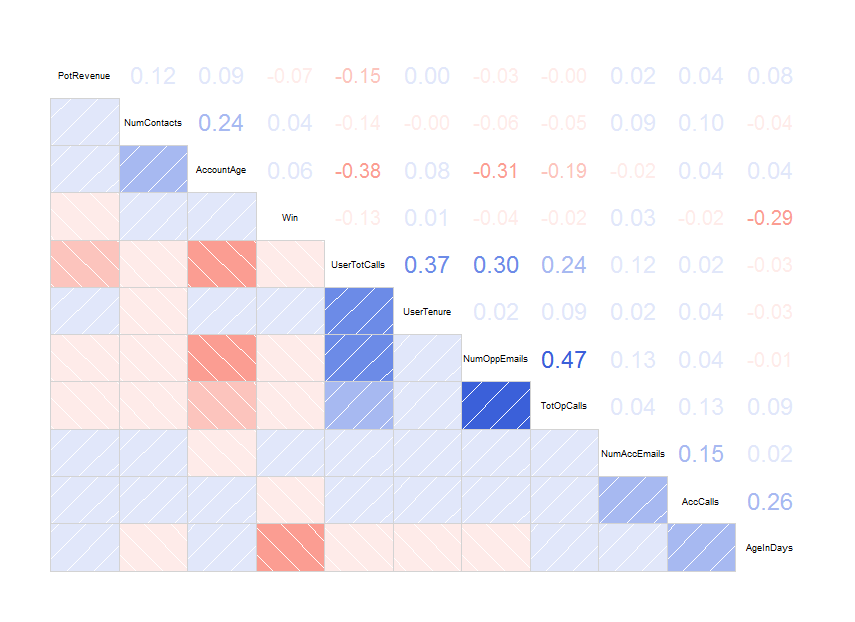

```

_`r figs("CorrGram","The corrgram shows the relationship between the predictors, and how correlated they are to each other.")`_

`r figs("CorrGram",display="cite")` shows that the predictors are not overly correlated, the highest r-squared value being
0.47. We can see that Opportunity Calls and Emails are moderately correlated, which certainly makes sense as the more
often a client is called, the more frequent the number of emails exchanged. What does not make sense is the negative correlation
between activities and winning a deal. The most logical explanation is that many reps are not entering their tasks and events,
particularly those reps that are winning more deals. This is consistent with many winning deals are closed after only
one day. It is likely that these reps are simply recording only those deals that they have already won. Gaming the
system in this way undermines the benefit of Salesforce, reducing it's ROI significantly. 

We can see the the age of the deal is negatively correlated with winning it. This is expected as many studies have shown
that the older the deal the less likely it is to be won. It's also a result of the above mentioned data issues.

# __Results__

## __Data Exploration__

Let's visualize the data to gain a better understanding of deals and how they are won. `r figs("AgeofWonVsLost",display="cite")` shows that there's a clear difference between the age of deals which are won and those which are lost. The average age
of wining deals is almost half that of the losing deals.

```{r, out.width = "300px", out.height="300px",  echo=FALSE, message=FALSE, fig.align="center"}

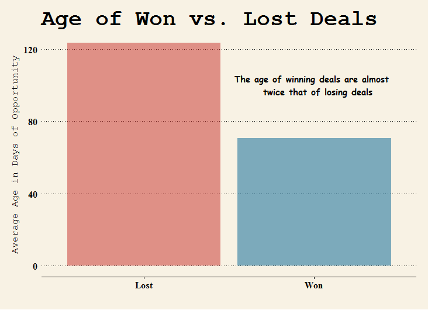

```

_`r figs("AgeofWonVsLost"," A comparision of the average age in days between deals that were won and deals that were lost.")`_

`r figs("ShareOfWonLost",display="cite")` shows that most won deals (green line) are won within 2 months, and lost deals
(red line) can linger. There's a spike in deals closed at around the 6 month period, perhaps due to an assessment of
all deals at that time, or a natural deal cycle. It's unusual not to see a curve in the winning line share, as the 
largest share of deals are closed within a couple days. This indicates that the reps are not entering the deal data
correctly, they are skipping stages, closing deals immediately after entering them, and not consistently 
entering losing deals.


```{r, out.width = "300px", out.height="300px",  echo=FALSE, message=FALSE, fig.align="center"}

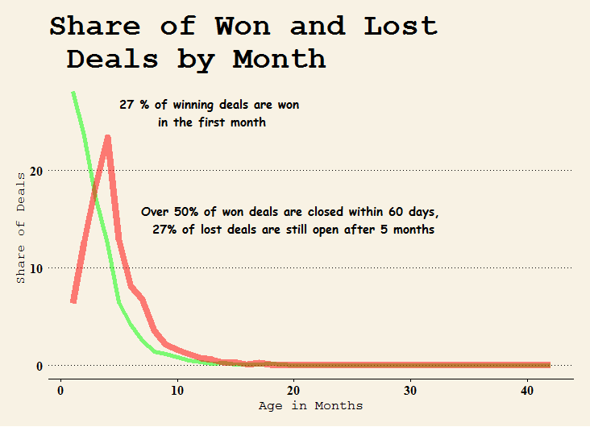

```

_`r figs("ShareOfWonLost","The share of all deals won by age of the deal in months. Green line is the share of won deals, and Red line shows the share of lost deals.")`_

`r figs("PercentWon",display="cite")` shows that the likelihood of a deal closing diminishes with time. After 70 days chances
are the deal won't be won. 

```{r, out.width = "300px", out.height="300px",  echo=FALSE, message=FALSE, fig.align="center"}

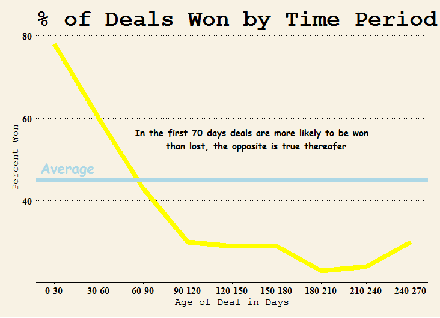

```

_`r figs("PercentWon","The percent of deals won by their age in days (yellow line). The average percent won is show with the blue line.")`_ 

If we compare various features between the deals that were won and those that were lost we see very little difference. 
`r figs("boxPlots",display="cite")` shows that there's no significant difference of those measures between
winning and losing deals. 
Calls are skewed to the right, meaning there are a great deal of opportunities with very few or no calls made
where the opportunity is associated with the task or event. It's likely that many reps are not properly indicating which
opportunity their call is associated with. This makes it difficult or impossible to assess and analyze the value of
the interaction to whether a deal was won. The calls may be of course made instead against the account, however that 
account lives beyond the opportunity. 

```{r, out.width = "300px", out.height="300px", echo=FALSE, message=FALSE, fig.align="center"}


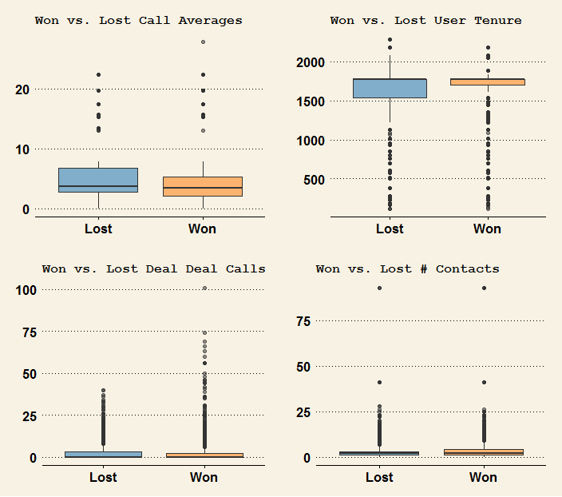

```

_`r figs("boxPlots","Boxplots of Call Averages, User Tenure, Deal Calls, and # Contacts between winning and losing deals.")`_

`r figs("DealsByDept",display="cite")` shows that win rates vary significantly by department from over 60% for the Quebec Freight Group to under 30% for the USA Freight group.  In many industries a win rate of over 30% suggests that only those 
 deals that are already  advanced in the selling cycle are being entered into Salesforce.com. Win rates this high are 
 suspicious. 

```{r, out.width = "300px", out.height="300px", echo=FALSE, message=FALSE, fig.align="center"}


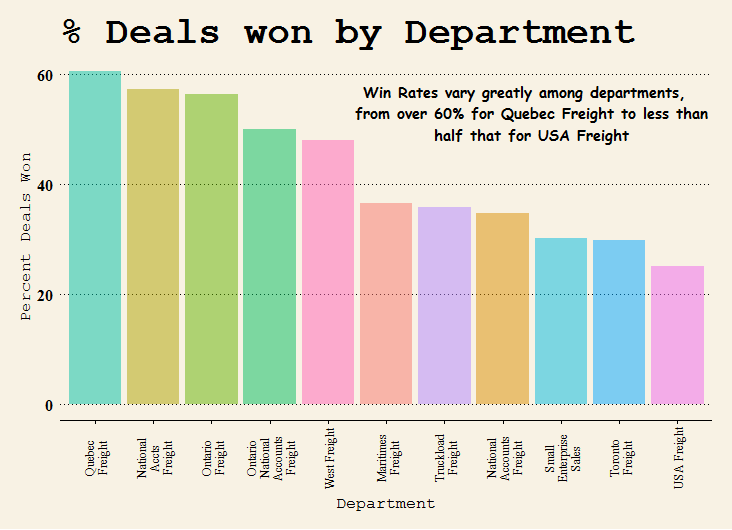

```

_`r figs("DealsByDept","The difference in the percent of deals won by department. Win rates vary significantly from over 60% to under 30%.")`_

`r figs("DeptWin",display="cite")` shows that departments that are closing the big deals do so fairly consistently each quarter.
Although this shows potential revenue of the deal, we could assume there's a high correlation between this and the eventual
actual revenue realized. 

```{r, out.width = "300px", out.height="300px", echo=FALSE, message=FALSE, fig.align="center"}


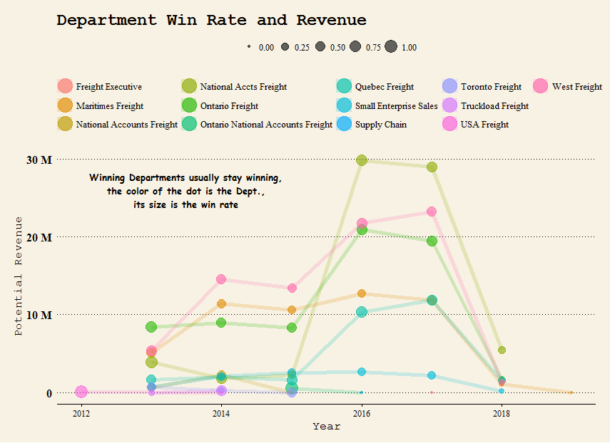

```

_`r figs("DeptWin","Win Rates by Department by Year. The size of the dot represents the win rate. There's consistency amond winning departments each year.")`_

By the same token winning reps are fairly consistent also. `r figs("Top6Reps",display="cite")` shows the top 6 reps by 
winning revenue and how they perform each year. Except for a pickup by National Accounts Freight, it's interesting that
the rank is almost fully preserved each year, as we can see by the fact the lines rarely overlap.


```{r, out.width = "300px", out.height="300px", echo=FALSE, message=FALSE, fig.align="center"}


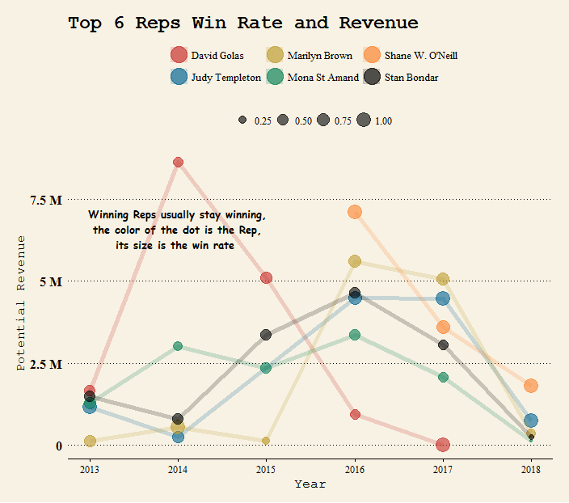

```

_`r figs("Top6Reps","Top Reps potential revenue won by year. The size of the dot represents the win rate. ")`_

## __Machine Learning Models__

In the last several years machine learning has developed into a powerful tool with applications in many
businesses. It is now recognized in fields from healthcare, to genetics, social sciences and business.
Machine learning models will now be applied to the Day & Ross data to predict winning deals. We can think of a model
as any function that has predictive power (Burger, 2018). We will divide the data we have into a training data set
and a test data set. Machine Learning compels us to train a data model, in other
words build the model using the training data set, and then test this model on unseen data, the 
test data set.

The R code and output for this section is show  in Appendix A.

### __Data Preparation__

Let's look at the structure of the data. We can see that the predictors have the correct data types. Those
that should be factors, and those that should be numeric are correctly designated. Stage and Type and CanOrNot(whether
a deal is Canadian) are factors, and the rest of the predictors are numeric.

```{r message=FALSE, echo=FALSE,  results='hide'}
str(Deals)
```

We first must filter the data to only include the closed opportunities. 
Then we will remove the Stage feature, which was only used to subset the data with targets used for training and test.


```{r message=FALSE, echo=FALSE, result='hide'}
DealsClosed <- filter(Deals, 
                      (Stage == 'Closed Lost') | (Stage == 'Closed Won'), (Win == 0 | Win == 1 ))
DealsClosed$Stage <- NULL
DealsClosed <- na.omit(DealsClosed)

```


Now we  split the data into a training set and a test data set. We will first make the target a factor. We then split the
data into 70% train and 30% test. This results in  `r nrow(Deal.train) ` records in the training set and 
`r nrow(Deal.test) ` records in the test data set. The training data set is used to build the model and the test set
will then be used to test the accuracy of our predictions against known results (whether or not the deal was
actually won).

```{r echo=TRUE, message=FALSE, echo=FALSE, results='hide'}
# Train Test Split
set.seed(110)

DealsClosed$Win <- factor(DealsClosed$Win)

split <- sample.split(DealsClosed$Win,SplitRatio = 0.70)
Deal.train <- subset(DealsClosed, split == TRUE)
Deal.test <- subset(DealsClosed, split == FALSE)

nrow(Deal.train)
nrow(Deal.test)

```

### __Logistic Regression__

Now let's build the model on the training data set. Logistic regression is a machine learning method of analyzing 
a dataset of one of more independent predictors that determine an outcome of a target which is a dichotomous 
variable (in this case the two possible outcomes are Closed/Win and Closed/Lose) (James et al, 2017). In other
words we want to predict whether a deal is won using the other fields that we have either summarized or derived. 

```{r echo=TRUE, message=FALSE, echo=FALSE, results='hide'}
DealLRmodel <- glm(Win ~ ., family = binomial(link='logit'), data=Deal.train)
```

Using the summary function revealed that ten of the coefficients were significant, which makes
the model a little complex. It makes sense that the age of the opportunity is negatively correlated with
winning, however the other coefficients are surprising. There's a negative correlation with potential 
revenue, total user calls, total opportunity emails and account emails, which could related to data quality 
issues. It's not surprising that total opportunity calls is positively correlated with winning a deal.

```{r echo=TRUE, message=FALSE, echo=FALSE, results='hide'}
summary(DealLRmodel)
```

Now let's use the model to predict the winning deals in the test set. We can compare the 
predictions with the actual results to find out how accurate the model is.
We first use the predict function against the test data set. This produces probabilities for each
deal. We then convert them to 1 or 0 - if a deal has a probability greater than 0.5 we convert it 
to a 1, the rest are converted to 0.

```{r echo=TRUE, message=FALSE, echo=FALSE, results=FALSE}

# let's predict using this model
fit.prob <- predict(DealLRmodel, Deal.test, type = 'response')
fit.res2 <- ifelse(fit.prob > 0.5,1,0)

misClassErr <- mean(fit.res2 != Deal.test$Win)

```

We now can determine the misclassification error of the model. This is the accuracy of our predictions.
The result it 67%. These results are fairly good. The fact that it was not higher is likely  a result of 
poor data quality which will be discussed later in the paper. 
The confusion matrix is then produced (`r tbls("LRConfuse",display="cite")`). 
This will show us the number of false positive and false negatives in our predictions. 

```{r echo=TRUE, message=FALSE, echo=FALSE, results='hide'}
print(1 - misClassErr)
table(Deal.test$Win, fit.prob > 0.5)
# March 2020
#confusionMatrix(fit.res2, Deal.test$Win)
```


```{r echo=FALSE, results='hide',message=FALSE}
library(xtable)

sfone <- c('0','1')
sftwo <- c('1710','809')
sfthree <- c('745', '1484')


sfCML <- data.frame(sfone, sftwo, sfthree)

colnames(sfCML) <- c(' ', 'False','True')

xtabsfCML <- xtable(sfCML) #, align=c('p{1in}','p{.8in}','r','p{3.5in}') )

print(xtabsfCML, scalebox = 0.8, include.rownames=FALSE)
```

_`r tbls("LRConfuse","The confusion matrix of the logistic regression model test set predictions.")`_

\begin{table}[ht]
\centering
\scalebox{0.8}{
\begin{tabular}{lrr}
  \hline
  & False & True \\ 
  \hline
0 & 1710 & 745 \\ 
  1 & 809 & 1484 \\ 
   \hline
\end{tabular}
}
\end{table}

In this case the positive class is 0. The positive predictive value is calculated as the number of
correct positive predictions out of the total number of positive predictions (Wang, 2013). In this case it's 71% slightly
higher than the negative predictive value of 65%. Therefore using our model is more useful at determining a losing
deal than at predicting a winning deal. With this in mind our model could be considered more useful at
screening for losing deals, which might help a rep spend less time on deals that ultimately will not be won.


Using the ROCR library we can now show a receiver operating characteristic curve (ROC). It's a plot that
illustrates the ability of a binary classifier as it's discrimination threshold is varied (James et al, 2017). It's a plot
of a true positive rate against a false positive rate at various threshold settings. The plot for our test data
set predictions are show in `r figs("ROC",display="cite")`.

```{r, out.width = "300px", out.height="300px", echo=FALSE, message=FALSE, results='hide'}

library(ROCR)
p <- predict(DealLRmodel, Deal.test, type="response")
pr <- prediction(p, Deal.test$Win)

prf <- performance(pr, measure = "tpr", x.measure = "fpr")
# plot(prf)
```

```{r, out.width = "300px", out.height="300px", echo=FALSE, message=FALSE}

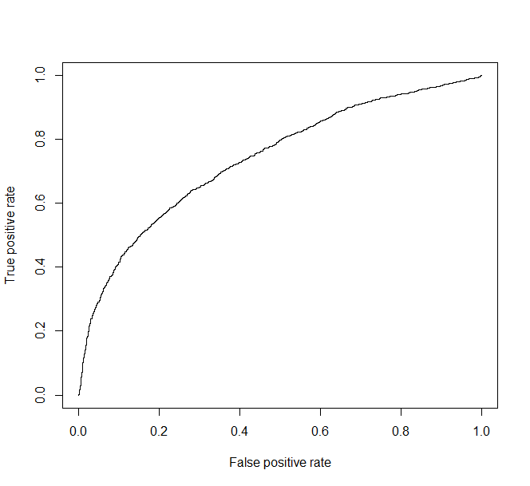

```

_`r figs("ROC","Receiver Operating Curve (ROC) for Lasso model of opportunity test set predictions.")`_

We can check the area under the curve (AUC) using the performance function. This shows the overall performance of
the classifier (James et al, 2017). In this case its 74%.

```{r, out.width = "300px", out.height="300px", echo=FALSE, message=FALSE, results='hide'}
auc <- performance(pr, measure = "auc")
auc <- auc@y.values[[1]]
auc
```


We can use the Lasso technique to reduce the number of variables. The Lasso technique is a fairly 
recent alternative to using ridge regression that overcomes the disadvantage of the former technique in that
it always generates a model using all of the predictors (Chatterjee & Hadi, 2012). We can perform a grid search to 
find optimal value of lambda using  the values of family=binomial  and alpha=1.


```{r, out.width = "300px", out.height="300px", echo=FALSE, message=FALSE, results='hide'}
library(glmnet)

x <- model.matrix(Win~.,Deal.train)
y <- Deal.train$Win

cv.out <- cv.glmnet(x,y,alpha=1,family="binomial",type.measure = "mse")
#plot result
# plot(cv.out)

```

The plot tells us that about 7 coefficients is optimal (`r figs("Lasso",display="cite")`). This graph 
uses the cross validation version of the glmnet function in R, and it results in a plot showing 
the MSE (mean squared error) of several iterations of the model under changing values of lambda 
(the "regularization parameter") (James et al, 2017).

```{r, out.width = "300px", out.height="300px", echo=FALSE, message=FALSE, fig.align="center"}

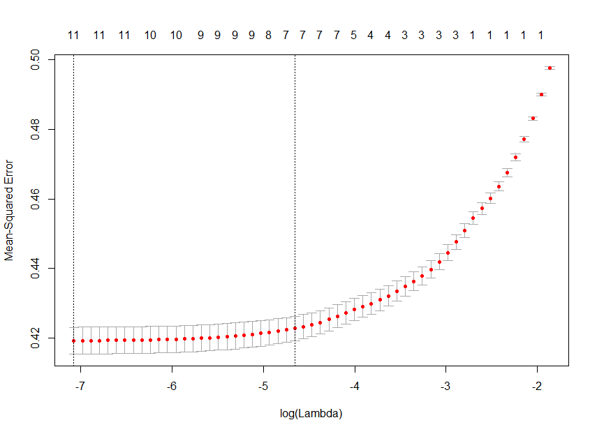

```

_`r figs("Lasso","Graph of the mean squared error (MSE) of various iterations of the model given varying values of lambda (the regularization parameter).")`_


```{r, out.width = "300px", out.height="300px", echo=FALSE, message=FALSE, results='hide'}
#~~~~~~~~~~~~~~~~~~~~~~~~~~~~~~~~~~~~~~~~~~~~~~~~~~~~~~~~~~~~~
#min value of lambda
lambda_min <- cv.out$lambda.min
#best value of lambda
lambda_1se <- cv.out$lambda.1se
#regression coefficients
coef(cv.out,s=lambda_1se)

```

Now we can examine the coefficients. 
We have reduced the model to only 7 coefficients now. Let's test the accuracy of this model.
The accuracy is about 67% which is about the same as we got before. The bias-variance trade off tells 
us that the simpler function should be preferred because it is less likely to over fit the training data.

```{r, out.width = "300px", out.height="300px", echo=FALSE, message=FALSE, results='hide'}
#get test data
x_test <- model.matrix(Win~.,Deal.test)
#predict class, type="class"
lasso_prob <- predict(cv.out,newx = x_test,s=lambda_1se,type="response")
#translate probabilities to predictions
lasso_predict <- rep(0,nrow(Deal.test))
lasso_predict[lasso_prob>.5] <- 1
#confusion matrix
table(pred=lasso_predict,true=Deal.test$Win)

#accuracy
mean(lasso_predict==Deal.test$Win)

```

#### __New Data__

We can now use the  model to predict whether open opportunities will be won or not. This time we
should include the names and IDs of the opportunities  so we can match them and make the information
more useful to the sales rep.

```{r, out.width = "300px", out.height="300px", echo=FALSE, message=FALSE, cache=TRUE, results='hide'}

dr.opportunities$Opportunity.Name <- as.character(dr.opportunities$Opportunity.Name)
dr.opportunities$Opportunity.Owner <- as.character(dr.opportunities$Opportunity.Owner)

DealsOpen <- select(dr.opportunities, Opportunity.ID, Opportunity.Name, Opportunity.Owner,
                    Stage, Type, Revenue.Potential, AccCalls, AgeInDays, TotOpCalls, 
                UserTotalCalls, UserTenure, AccountAge, NumContacts, NumOppEmails, 
                NumAccountEmails,Billing.Country, Win)

colnames(DealsOpen) <- c("ID", "Name", "Owner","Stage", "Type", "PotRevenue", "AccCalls", 
                         "AgeInDays", "TotOpCalls", "UserTotCalls", "UserTenure", "AccountAge", 
                         "NumContacts", "NumOppEmails", "NumAccEmails", "CanOrNot", "Win")


DealsOpen <- filter(DealsOpen, (Stage != 'Closed Lost') & 
                      (Stage != 'Closed Won'), (Win == 0 | Win == 1 ))
DealsOpen$Stage <- NULL
DealsOpen <- na.omit(DealsOpen)

```

Now we can use the predict function to predict whether these deals will be won. We will keep the probabilities 
and present this so a determination can be made as to which deals are more likely to be won. We have to exclude
the three new columns as the model was not built using them.

```{r, out.width = "300px", out.height="300px", echo=FALSE, message=FALSE, cache=TRUE, results='hide'}

fitOpen.prob <- predict(DealLRmodel, DealsOpen[4:16], type = 'response')

DealsOpen$DealProb <- fitOpen.prob 
DealsOpen$DealProb <- round(DealsOpen$DealProb,3)

```

Exporting this to excel makes these results more presentable. The probabilities could easily be loaded into
Salesforce.com matching on the opportunity IDs. In this way reps could have immediate access to this information.

```{r, out.width = "300px", out.height="300px", echo=FALSE, message=FALSE, cache=TRUE, results=FALSE}
write.csv(select(DealsOpen, ID, Name, Owner, DealProb), file = "DealProb.csv")
```

Part of the final file, conditionally formatted, is shown in `r figs("ExcelProb",display="cite")`:

```{r, out.width = "300px", out.height="300px", echo=FALSE, message=FALSE, fig.align="center"}

knitr::include_graphics("ExcelProb.png")

```

_`r figs("ExcelProb","Excel file of Deals with their predicted probability of winning conditionally formatted.")`_

<!-- ###__Support Vector Machines__ -->

<!-- Support Vector Machines are a supervised learning technique that produces models with associated learning -->
<!-- algorithms that analyze data and recognize patterns used for classification and regression analysis (James, 2017). -->
<!-- An SVM model is a representation of the examples as plots in space which are mapped so that the examples -->
<!-- of the separate categories are divided by a clear gap that is as wide as possible. -->

<!-- New examples are mapped into the same space and predicted to belong to a category based on which side of the -->
<!-- gap they fall on. A hyperplane maximizes the distance between the classes.  -->

<!-- We build the model using the same general syntax as before on the training data set.  -->
<!-- The e1071 package in R is required. The summary of the model shows that 7407 support -->
<!-- vectors were created and the gamma is .077 with a cost of 1. There were two classes (Won or Lost Deals, 1 or 0). -->

```{r, out.width = "300px", out.height="300px", eval=FALSE, echo=FALSE, message=FALSE}

SvmModel <- svm(Win ~., data=Deal.train)
summary(SvmModel)

```

<!-- As before we can use the model the predict values using the test data set. The model achieved 71% accuracy, only -->
<!-- marginally better than using logistic regression. It's interesting that in contrast to the results of the logistic -->
<!-- regression model, this model has a higher negative predictive value (73%), which means it's better at predicting winning -->
<!-- deals than losing deals. -->

```{r, out.width = "300px", out.height="300px", eval=FALSE, echo=FALSE, message=FALSE, cache=TRUE}
Svm.Predict <- predict(SvmModel, Deal.test[-13] )
table(Svm.Predict,Deal.test$Win)
mean(Svm.Predict==Deal.test$Win)

confusionMatrix(Svm.Predict, Deal.test$Win)
```

<!-- Let's focus now on tuning the support vector machine. When we called summary on the model we found -->
<!-- the cost and gamma. Cost allows the SVM to have what is called a soft margin, meaning the SVM allows some -->
<!-- examples to be ignored or placed on the wrong side of the margin. The gamma parameter is a little more complicated. -->
<!-- It involves non linear kernel functions. If gamma is large there is high bias. -->

<!-- Let's use r to help find the best cost and gamma values. We use the tune function to do this.  -->

```{r, out.width = "300px", out.height="300px", eval=FALSE, echo=FALSE, message=FALSE, cache=TRUE}

df <- Deal.train

df$Type <- ifelse(df$Type=="Expanded",1,0)
df$CanOrNot <- as.numeric(df$CanOrNot)
df$Win <- as.numeric(df$Win)
#tune.results.Svm <- tune(svm,train.x=df[-13],train.y=df[13],kernel='radial',ranges 
#= list(cost=c(0.1,1,10),gamma=c(0.5,1,2)))
# summary(tune.results.Svm)
```

<!-- The summary of the tuning output provides us with the best cost and gamma values (`r figs("SvmTune",display="cite")`). -->

```{r, out.width = "200px", out.height="200px", echo=FALSE, eval=FALSE, message=FALSE, cache=TRUE, fig.align="center"}

knitr::include_graphics("SvmTune.png")

```

<!-- _`r figs("SvmTune","Output of SVM tuning.")`_ -->

<!-- Now we can run the model again with parameters that are equal to the best parameters. The new accuracy is 72%  -->
<!-- so we have not gained much at all. -->

```{r, out.width = "300px", out.height="300px", echo=FALSE, message=FALSE, eval=FALSE, cache=TRUE, results='hide'}
SvmTunedModel <- svm(Win ~., data=Deal.train, cost=1, gamma=2)
Svm.Predict <- predict(SvmTunedModel, Deal.test[-13] )
table(Svm.Predict,Deal.test$Win)
mean(Svm.Predict==Deal.test$Win)

```


### __Random Forest__

The next modeling technique applied is random forest. The random forest (Breiman, 2001) is an ensemble method 
that one can think of as a type of nearest neighbor predictor. Ensembles are a approach that divides and conquers 
to improve performance. The main point of ensemble methods is to allow "weak learners" to come together to 
form a "strong learner". 

When we apply the random forest model and use it to predict against the test data set we can see that the 
accuracy is 77.5% which is quite a bit better than the logistic regression model. The confusion 
matrix is also shown (`r tbls("ForestConfuse",display="cite")`). As opposed to the other models 
this model has almost equally positive and negative predictive values (77.95% vs 77.72%) which means 
it's equally good at predicting winning as well as losing deals.

_`r tbls("ForestConfuse","The confusion matrix of the random forest model test set predictions.")`_

\begin{table}[ht]
\centering
\scalebox{0.8}{
\begin{tabular}{lrr}
  \hline
  & False & True \\ 
  \hline
0 & 2069 & 614 \\ 
  1 & 450 & 1615 \\ 
   \hline
\end{tabular}
}
\end{table}

```{r, out.width = "300px", out.height="200px", echo=FALSE,  message=FALSE, results='hide', cache=TRUE}

rfModel <- randomForest(Win ~ ., data=Deal.train, ntree=500, importance=TRUE)

y_pred = predict(rfModel, newdata = Deal.test[-13])
cm = table(Deal.test[,13], y_pred)
cm
1 - mean(y_pred != Deal.test$Win)

confusionMatrix(y_pred, Deal.test$Win)
```

Most studies on random forests are difficult to interpret since they are typically treated like a black box 
(Palczewska, 2014). It's true that a forest is made up of many of deep trees, and each of these trees is trained 
using a random selection of features, so obtaining  a complete understanding of process by 
which decisions are made by examining each individual tree is impractical. A tree with a depth of 500, 
as in this case, can have tens of thousands of nodes, which means it's impossible to use as an explanatory model.

We can however check the relative importance of each variable using the importance function in the 
random forest package (`r figs("rfModelImportance",display="cite")`). 
Here we can see that Age in Days (the age of the opportunity) is the most important 
feature, which makes sense given our previous findings. Potential revenue, account age and account calls are also
important, however we do not know if they have a positive or negative effect. 

```{r, out.width = "300px", out.height="200px", echo=FALSE, message=FALSE, fig.align="center"}


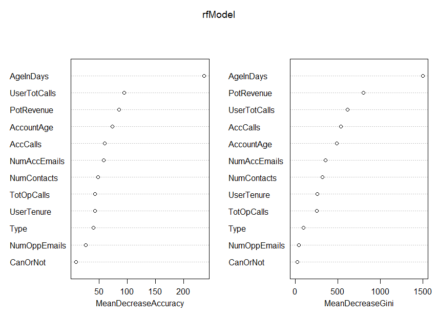

```

_`r figs("rfModelImportance","The relative importance of each variable using the random forest importance function.")`_

#### __New Data__

The random forest model had a prediction accuracy of almost 10% greater than that of logistic regression. It's
worthwhile therefore to use this model to predict results based on new data, those deals which are still open.
We can then combine these predictions with those obtained by the logistic regression model to provide more
insight to Day & Ross. 

```{r, out.width = "300px", out.height="200px", echo=FALSE, message=FALSE, results='hide'}


y_predOpen = predict(rfModel, newdata = DealsOpen[4:16])


```

The results are added to the data frame and exported to a csv file again (`r figs("ExcelProbPlus",display="cite")`) . 
Now we have a file with both the logistic regression and random forest results.

```{r, out.width = "300px", out.height="200px", echo=FALSE, message=FALSE, results='hide'}

DealsOpen$DealsRfPred <- y_predOpen
write.csv(select(DealsOpen, ID, Name, Owner, DealProb, DealsRfPred), 
          file = "DealProb.csv")

```

With the added prediction of the random forest model, the sales rep can better focus on those
deals that have both a high probability score and a positive predicted outcome by the random forest model.

```{r, out.width = "300px", out.height="300px", echo=FALSE, message=FALSE, fig.align="center", results=FALSE}

knitr::include_graphics("ExcelProbPlus.png")

```

_`r figs("ExcelProbPlus","Excel file of Deals with their predicted probability of winning and the random forest model predictions conditionally formatted.")`_


# __Validity & Reliability Assessment__

We have examined the accuracy of the logistic regression and random forest models against the test 
data sets and found that they had a prediction accuracy of 67% and 78% respectively. Another method to 
evalute the model is to test how well it performs on certain subsets of the data. A popular way to 
do this is k-fold cross-validation in which the data is partitioned into k segments (or folds) 
of equal size (Burger, 2018). We hold out one segment for validation and use the other k-1 segments to 
train the data and we then repeat this k number of times. We track the accuracy of each model in 
predicting the set of data that is held out.

When we perform the k-folds validation the model shows a summary of different samples sizes, 9972, 9972, 9971, 
9971, and 9970 etc. The accuracy of the model is 67.7% which is roughly what we obtained previously. This gives
us  a greater amount of confidence in the model. The confusion matrix of this k-folds cross validation model 
shows higher performance predicting losing deals (70%) than winning deals (65%), much like our previous model.

```{r, out.width = "300px", out.height="200px", echo=FALSE, message=FALSE, results='hide'}

ctrl <- trainControl(method = "repeatedcv", number = 10, savePredictions = TRUE)


mod_fit <- train(Win ~ .,  data=Deal.train, method="glm", family="binomial",
                 trControl = ctrl, tuneLength = 5)

print(mod_fit)


pred = predict(mod_fit, newdata = Deal.test[-13])
confusionMatrix(data=pred, Deal.test$Win)

```


<!-- A discussion of how the accuracy of analysis-driven -->
<!-- recommendations should be tested in future implementation -->

# __Recommendations__

Based on the analysis and modeling of the data I can make the following recommendations in order 
to better leverage Salesforce.com in the future.

## __Machine Learning__

Machine Learning and AI are growing at a tremendous pace. International Data Corporation (IDC) predicts 
that spending on AI and ML will grow from $12B in 2017 to 57.6B by 2021 (IDC, 2016). Salesforce.com has
described how we are currently living in the fourth industrial revolution on business in which data is the
new currency and artificial intelligence is driving innovation where the more data you have the better your
predictions (Salesforce.com, 2018).

Salesforce.com's Einstein Analytics is an option for many companies with Salesforce to leverage AI however
it's expensive and best used when there's universal buy in for Salesforce.com and data quality is high.
That's not the case at Day & Ross. 

I recommend the following actions:

\begin{enumerate}
\item Use the results of the logistic regression and random forest predictions for open deals by creating a custom
field in Salesforce.com and apply the same conditional formatting as in the excel file provided.
Load the results into Salesforce.com by matching the opportunity IDs\footnote{The opportunity ID 
found in reports and through the Salesforce interface is 15 characters, when Apex Data Loader 
is used to extract opportunities the opportunity ID will be 18 characters as it includes a 
trailing 3 character checksum. This can be removed in order to match IDs.}. In this way sales reps can 
see which deals are most likely to be won and concentrate their efforts on these. A sales rep's time is limited
and to be most productive it's usually best to focus on deals with the highest likelihood of success and ignore
those with the lowest.

\item Revisit machine learning to predict success for deals in the future once data quality issues are addressed.
Despite the data quality issues the random forest model predicted the outcome of a deal with 78\% accuracy, which
is not bad considering many calls were not properly captured and sales reps skipped phases, likely only
entering deals once they had already progressed through the pipeline, and closing a great many deals in 0 days.
Once these issues are resolved it's likely that the predictive accuracy of the model will increase and
the factors which influence whether a deal is won will be better understood.

\item Leverage machine learning and analytics on other parts of the business. For example lead scoring can 
be done in a similar way. A prediction of whether a lead will be converted might be 
useful to know which leads warrant greater effort, and what it is that made for a successful lead. 

\item Include more sales reps in deals. At Day \& Ross Freight there's only one owner of each opportunity, however
it's often wise to include different employees at various stages of the deal depending on their strengths. 
This should be recorded so it can be analyzed in the future. It's been shown that involving more team members in
a deal correlates with success. 

\item Capture the actual revenue from a deal, not just the potential revenue as estimates can be inaccurate. 
Having the actual revenue would allow for more meaningful analysis and using the actual revenue as a target
for a machine learning algorithm would be a very interesting future project.
\end{enumerate}

## __Data Quality__

Data quality is obviously something that must be addressed by Day & Ross. The following data quality related
issues were observed and recommendations on how to resolve these issues are given:

\begin{enumerate}
\item All opportunity calls were not recorded. 

There are relatively very few calls made that were directly 
associated with the deal. It's important to record this so that the benefit of calls can be assessed in the future
and so that sales reps have a record of these calls in order to help them progress in closing deals. 
The fact that opportunity calls were not found to be well correlated with success is very surprising, and it
does not mean that the fewer calls the better, instead this indicates that calls were not being 
properly recorded. This is reinforced by the finding that the overall number of calls that a sales rep
makes is in fact an important factor to the random forest model. 

\item Data quality overall is very poor. 

City fields have many misspellings, postal codes are missing or
inaccurate, start dates of many opportunities are later than the end dates, many fields are missing when they
should be required, such as the subject field in the task and event objects. In order to 
alleviate these issues I recommend:

\begin{enumerate}
\item Converting some free form text fields to list boxes. Although analysis can be done on text fields it's more
straightforward analyzing fields that have limited options. In addition this will help ensure privacy rules
are adhered to as free form text fields can be a privacy risk.
\item Making several fields such as subject in tasks and events required. As the fields currently have missing
the first step would probably be to update the fields with values using the apex data loader prior to making
the field required.
\item Adding validation to many fields. This will ensure end dates come after start dates, that an opportunity
for each activity is chosen, and that postal codes of addresses are correct when entered.
\item The task and event objects should be consolidated. There seems to be no reason to use both. 
All events should be loaded into task and task should be used exclusively in the future.
\item The Prior Stage of the pipeline should be captured in Salesforce with a custom field and dashboards to obtain
full visibility of the pipeline should be created. 
A company should encourage trust so there's  no fear at all in setting a deal to Closed Lost. 
In many types of businesses having a win rate over 30\% suggests that only sales deals that are already well 
established in the sales cycle are entered into the pipeline. This means a company misses  out 
on pipeline visibility. This can be addressed by using dashboard charts to measure sales pipeline quality and
by capturing the prior stage of a deal to ensure reps are moving through the stages properly.
\end{enumerate}
\end{enumerate}

Ultimately the most important thing by far to achieving a return on investment from Salesforce.com is executive 
buy in. Unless Salesforce.com becomes the system of record and there's incentive for using the system it will
be difficult to realize value from the system. If a rep is successful management
may believe the adage "if it's not broke why fix it". However the true value of CRM is discovering what makes
a good sales rep good and imparting this knowledge to under performing reps. The only way to do this is
everyone uses the system properly, entering all their calls. When this is done the value of Salesforce.com
can be enormous.

\newpage

# __References__

<!---
Arnold, V., Clark, N., Collier, P. A., Leech, S. A., Sutton, S. G., 2006. 
The differential use  and effect of knowledge-based system explanations in novice and expert judgment 
decisions. Mis Quarterly, 79-97.
--->
Breiman, L. Machine Learning (2001) 45: 5. https://doi.org/10.1023/A:1010933404324

Burger, S. V. (2018). Introduction to Machine Learning With R Rigorous Mathematical Analysis. Oreilly & Associates Inc.

Chatterjee, S., & Hadi, A. S. (2012). Regression analysis by example. Hoboken, NJ: Wiley.

Columbus, L. (2016, May 28). 2015 Gartner CRM Market Share Analysis Shows Salesforce In The Lead, 
Growing Faster Than Market. Retrieved February 10, 2018, from https://www.forbes.com/sites/louiscolumbus/2016/05/28/2015-gartner-crm-market-share-analysis-shows-salesforce-in-the-lead-growing-faster-than-market/#7bc20aca1051

Day & Ross Transportation Group., 2017. Retrieved February 04, 2018, from http://www.dayrossgroup.com/

Deloitte Global 2017 TMT Predictions: Mobile Machine Learning expected to expand, helping to transform society | Deloitte China | Press release. (2017, January 22). Retrieved February 10, 2018, from https://www2.deloitte.com/cn/en/pages/about-deloitte/articles/pr-deloitte-tmt-2017-predictions.html

Evans, B. (2018, January 30). Oracle Places Huge Bets On AI And Machine Learning To Overtake Salesforce In SaaS. Retrieved February 10, 2018, from https://www.forbes.com/sites/bobevans1/2018/01/30/oracle-places-huge-bets-on-a-i-and-machine-learning-to-overtake-salesforce-com-in-saas/#19d037c81da1

Finelli, R., (2018, Feb 2). Personal interview.
<!---
Geron, A. (2017). Hands-on machine learning with Scikit-Learn and TensorFlow: concepts, tools, and techniques to build intelligent systems. Beijing: OReilly.
--->
IDC, (2018). "Worldwide spending on cognitive systems forecast to soar to more than $31 billion in 2019, according to
a new IDC spending guide," press release, March 8, 2016, www.idc.com/getdoc.jsp?containerId=prUS41072216. 

James, G., Witten, D., Hastie, T., & Tibshirani, R. (2017). An introduction to statistical learning: with applications in R. New York: Springer.

Palczewska, A., Palczewski, J., Robinson, R. M., & Neagu, D. (2014). Interpreting Random Forest Classification Models Using a Feature Contribution Method. Integration of Reusable Systems Advances in Intelligent Systems and Computing, 193-218. doi:10.1007/978-3-319-04717-1_9

Provost, F., Fawcett, T., (2013). Data science and its relationship to big data and data-driven 
decision making. Big Data 1 (1), 51-59.

Salesforce.com., (2018). Impacts of the Fourth Industrial Revolution. Retrieved March 11, 2018, from https://trailhead.salesforce.com/modules/impacts-of-the-fourth-industrial-revolution/units/understand-the-impact-of-the-fourth-industrial-revolution-on-business

TDWI. (2016). TDWI Analytics Maturity Model and Assessment Tool. Retrieved February 11, 2018, from https://tdwi.org/pages/maturity-model/analytics-maturity-model-assessment-tool.aspx

Wang H., Zheng H. (2013) Positive Predictive Value. In: Dubitzky W., Wolkenhauer O., Cho KH., Yokota H. (eds) Encyclopedia of Systems Biology. Springer, New York, NY


\newpage

# __Appendix A__

## __Machine Learning Models__

### __Data Preparation__

```{r echo=TRUE, message=FALSE}
#Structure of the Data
str(Deals)
```


```{r echo=TRUE, message=FALSE}
# We first must filter the data to only include the closed opportunities.
DealsClosed <- filter(Deals, 
                      (Stage == 'Closed Lost') | (Stage == 'Closed Won'), (Win == 0 | Win == 1 ))
DealsClosed$Stage <- NULL
# Remove NA Records
DealsClosed <- na.omit(DealsClosed)
```


```{r echo=TRUE, message=FALSE}
# Train Test Split
set.seed(110)

DealsClosed$Win <- factor(DealsClosed$Win)

split <- sample.split(DealsClosed$Win,SplitRatio = 0.70)
Deal.train <- subset(DealsClosed, split == TRUE)
Deal.test <- subset(DealsClosed, split == FALSE)

# Numbers of rows of training and test
nrow(Deal.train)
nrow(Deal.test)
```

### __Logistic Regression__

```{r echo=TRUE, message=FALSE}
# Build the logistic Regression Model
DealLRmodel <- glm(Win ~ ., family = binomial(link='logit'), data=Deal.train)
```


```{r echo=TRUE, message=FALSE}
# Use the summary function to check the coefficients of the model
summary(DealLRmodel)
```


```{r echo=TRUE, message=FALSE}
# let's predict the winning deals using this model

fit.prob <- predict(DealLRmodel, Deal.test, type = 'response')
fit.res2 <- ifelse(fit.prob > 0.5,1,0)

misClassErr <- mean(fit.res2 != Deal.test$Win)
```


```{r echo=TRUE, message=FALSE}
# Determine the misclassification error of the model. This is the accuracy of our predictions.
print(1 - misClassErr)
table(Deal.test$Win, fit.prob > 0.5)

#confusionMatrix(fit.res2, Deal.test$Win)
```


```{r, out.width = "300px", out.height="300px", echo=TRUE, message=FALSE, results='hide'}
# Using the ROCR library we can now show a receiver operating characteristic curve (ROC).
library(ROCR)
p <- predict(DealLRmodel, Deal.test, type="response")
pr <- prediction(p, Deal.test$Win)

prf <- performance(pr, measure = "tpr", x.measure = "fpr")
# plot(prf)
```

We can check the area under the curve (AUC) using the performance function. This shows the overall performance of
the classifier (James et al, 2017). In this case its 74%.

```{r, out.width = "300px", out.height="300px", results='hide'}
# We can check the area under the curve (AUC) using the performance function
auc <- performance(pr, measure = "auc")
auc <- auc@y.values[[1]]
auc
```


```{r, out.width = "300px", out.height="300px", results='hide'}
# Lasso technique to reduce the number of variables.
library(glmnet)

x <- model.matrix(Win~.,Deal.train)
y <- Deal.train$Win

cv.out <- cv.glmnet(x,y,alpha=1,family="binomial",type.measure = "mse")
#plot result
# plot(cv.out)

```


```{r, out.width = "300px", out.height="300px", results='hide'}
#Now we can examine the coefficients. 
#min value of lambda
lambda_min <- cv.out$lambda.min
#best value of lambda
lambda_1se <- cv.out$lambda.1se
#regression coefficients
coef(cv.out,s=lambda_1se)

```


```{r, out.width = "300px", out.height="300px", results='hide'}
# We have reduced the model to only 7 coefficients now. Let's test the accuracy of this model.
#get test data
x_test <- model.matrix(Win~.,Deal.test)
#predict class, type="class"
lasso_prob <- predict(cv.out,newx = x_test,s=lambda_1se,type="response")
#translate probabilities to predictions
lasso_predict <- rep(0,nrow(Deal.test))
lasso_predict[lasso_prob>.5] <- 1
#confusion matrix
table(pred=lasso_predict,true=Deal.test$Win)
#accuracy
mean(lasso_predict==Deal.test$Win)
```

#### __New Data__

```{r, out.width = "300px", out.height="300px", echo=TRUE, message=FALSE, cache=TRUE}
# Let's use the model to predict whether open opportunities will be won or not.
dr.opportunities$Opportunity.Name <- as.character(dr.opportunities$Opportunity.Name)
dr.opportunities$Opportunity.Owner <- as.character(dr.opportunities$Opportunity.Owner)

DealsOpen <- select(dr.opportunities, Opportunity.ID, Opportunity.Name, Opportunity.Owner,
                    Stage, Type, Revenue.Potential, AccCalls, AgeInDays, TotOpCalls, 
                UserTotalCalls, UserTenure, AccountAge, NumContacts, NumOppEmails, 
                NumAccountEmails,Billing.Country, Win)

colnames(DealsOpen) <- c("ID", "Name", "Owner","Stage", "Type", "PotRevenue", "AccCalls", 
                         "AgeInDays", "TotOpCalls", "UserTotCalls", "UserTenure", "AccountAge", 
                         "NumContacts", "NumOppEmails", "NumAccEmails", "CanOrNot", "Win")


DealsOpen <- filter(DealsOpen, (Stage != 'Closed Lost') & 
                      (Stage != 'Closed Won'), (Win == 0 | Win == 1 ))
DealsOpen$Stage <- NULL
DealsOpen <- na.omit(DealsOpen)

```


```{r, out.width = "300px", out.height="300px", echo=TRUE, message=FALSE, cache=TRUE}
# Now we can use the predict function to predict whether these deals will be won.
fitOpen.prob <- predict(DealLRmodel, DealsOpen[4:16], type = 'response')

DealsOpen$DealProb <- fitOpen.prob 
DealsOpen$DealProb <- round(DealsOpen$DealProb,3)
```


```{r, out.width = "300px", out.height="300px", echo=TRUE, message=FALSE, cache=TRUE}
# Let's export this to excel so we can makes these results more presentable.
write.csv(select(DealsOpen, ID, Name, Owner, DealProb), file = "DealProb.csv")
```

#### __Validity & Reliability Assessment__


```{r, out.width = "300px", out.height="300px", echo=TRUE, message=FALSE, cache=TRUE}
# Cross Validation of model
ctrl <- trainControl(method = "repeatedcv", number = 10, savePredictions = TRUE)
# Fit the k-folds cross validation model
mod_fit <- train(Win ~ .,  data=Deal.train, method="glm", family="binomial",
                 trControl = ctrl, tuneLength = 5)
# Check out the model
print(mod_fit)
# Use this model to predict on the test set
pred = predict(mod_fit, newdata = Deal.test[-13])
# Look the the confustion matrix of this model
confusionMatrix(data=pred, Deal.test$Win)
```


### __Random Forest__

```{r, out.width = "300px", out.height="200px", echo=TRUE,  message=FALSE}
# The next modeling technique applied is Random Forest.
rfModel <- randomForest(Win ~ ., data=Deal.train, ntree=500, importance=TRUE)
y_pred = predict(rfModel, newdata = Deal.test[-13])
cm = table(Deal.test[,13], y_pred)
cm
1 - mean(y_pred != Deal.test$Win)
confusionMatrix(y_pred, Deal.test$Win)
```

#### __New Data__


```{r, out.width = "300px", out.height="200px", echo=TRUE, message=FALSE}
# Predicting the results of the new data using random forest model
y_predOpen = predict(rfModel, newdata = DealsOpen[4:16])
```


\newpage

# __Appendix B__

The following section contain the R code used for the data cleaning and visualization used in the project.

## __Data Cleaning__

```{r eval=FALSE}
# Count Unique Calls on the Account during the period in which the Opportunity is active
CountCalls <- function(CreDate, CloDate, AccID, OppId){
  numCalls <- subset(dr.task,
                     (dr.task$TaskCreatedDate > CreDate & dr.task$TaskCreatedDate < 
                        CloDate)
                     & dr.task$TaskAccountID == AccID)
  return(nrow(numCalls))
}

updDateOppAccCalls <- function()
  for (row in 1:nrow(dr.opportunities)){
    OppID <- dr.opportunities[row, "Opportunity.ID"]
    AccID <- dr.opportunities[row, "Account.ID"]
    CreDate <- dr.opportunities[row, "Created.Date"]
    CloDate <- dr.opportunities[row, "Close.Date"]
    numCalls <- CountCalls(CreDate, CloDate, AccID, OppId)
    dr.opportunities[row, "AccCalls" ] <<- numCalls
  }
# Create an Age in Days field and update it for all opportunities
# Opportunities that are open will use Feb 7th as the day to calculate
# the closed data as this is when the file was received

# Create the new field
dr.opportunities$AgeInDays <- 0
dr.opportunities$AccCalls <- as.integer(dr.opportunities$AccCalls)


# Update the Age of all Closed Opportunities
dr.opportunities$AgeInDays <-
  ifelse((dr.opportunities$Stage == 'Closed Lost') | (dr.opportunities$Stage == 
                                                        'Closed Won'),
         difftime(dr.opportunities$Close.Date, dr.opportunities$Created.Date, 
                  units="days"),
         dr.opportunities$AgeInDays)

#Update the Age of all Open Opportunities with Feb 7th date
dr.opportunities$AgeInDays <-
  ifelse((dr.opportunities$Stage != 'Closed Lost') & (dr.opportunities$Stage != 
                                                        'Closed Won'),
         round(difftime("2018-02-07", dr.opportunities$Created.Date, 
                        units="days"),0),
         dr.opportunities$AgeInDays)

# Import User Data
dr.user<- read.csv('User.csv', header = FALSE)


colnames(dr.user) <- c('UserID','Username', 'LastName','FirstName','ProfileName',
                       'RoleName','Department', 'ManagerFullName',
                       'Active','CreatedDate', 'UserTenure','UserTotalCalls',
                       'DailyCallAvg')

dr.user$UserID <- as.character(dr.user$UserID)

# Convert Date to Date format
dr.user$CreatedDate <- as.Date(dr.user$CreatedDate)

#Create and Update User Tenure Column
dr.user$UserTenure2 <- 0
dr.user$UserTenure2 <- round(difftime("2018-02-07", dr.user$CreatedDate, 
                                      units="days"),0)

#Create and update a todal calls column
dr.user$UserTotalCalls2 <- 0

# Function to count all calls in Tasks user by user
UserCalls <- function(UserID){
  numCalls <- subset(dr.task, dr.task$TaskCreatedByID == UserID)
  return(nrow(numCalls))
}

updUserCalls <- function()
  for (row in 1:nrow(dr.user)){
    UserID <- dr.user[row, "UserID"]
    dr.user[row, "UserTotalCalls2" ] <<- UserCalls(UserID)
}

# Call the function to update the User's total calls
updUserCalls()

# All the opportunity calls - calls where the opportunity was indicated
# The WhatID of the task = opportunityID

# Create the new column

dr.opportunities$OppCalls <- 0

CountCalls <- function(OppID){
  numCalls <- subset(dr.task, dr.task$TaskWhatID == OppID)
  return(nrow(numCalls))
}

updOppCalls <- function()
  for (row in 1:nrow(dr.opportunities)){
    OppID <- dr.opportunities[row, "Opportunity.ID"]
    dr.opportunities[row, "OppCalls" ] <<- CountCalls(OppID)
}

updOppCalls()

# Opportunity calls
# Group all the tasks by TaskWhatID (this related to the opportunityID in 
# Opportunity)
call_count <- dr.task %>% group_by(TaskWhatID) %>% summarise( count_calls = n())

#merge the dataframes

colnames(call_count) <- c('Opportunity.ID', 'TotOpCalls')

dr.opportunities <- merge(x = dr.opportunities, y = call_count, by = 
                            "Opportunity.ID", all.x = TRUE)

# User
dr.user.sub <- dr.user[,c("UserID","ProfileName","Active","UserTenure",
                          "UserTotalCalls2","UserTenure2")]
colnames(dr.user.sub) <- c("User.ID","ProfileName","UserActive","UserTenure",
                           "UserTotalCalls","UserTenure")
dr.user.sub$UserTotalCalls <- as.integer(dr.user.sub$UserTotalCalls)
dr.user.sub$UserTenure <- ROUND(as.integer(dr.user.sub$UserTenure),0)

#merge dataframe opportunities with user

dr.opportunities <- merge(x = dr.opportunities, y = dr.user.sub, by = "User.ID", 
                          all.x = TRUE)

dr.opportunities$OppCalls <- NULL
dr.opportunities$UserTenure <- NULL

dr.opportunities.back <- dr.opportunities

colnames(dr.opportunities)[25] <- c("UserTenure")
ncol(dr.opportunities)

# Load Accounts

dr.account <- read.csv('Accounts.csv')
dr.account$Created.Date <- as.Date(dr.account$Created.Date,'%d/%m/%Y')

dr.account$AccountAge <- as.integer(round(difftime("2018-02-07", 
                                                   dr.account$Created.Date, units = 
                                                     "days"),0))

dr.opportunities$UserTenure <- as.integer(dr.opportunities$UserTenure)

dr.account.sub <- dr.account[,c("Account.ID","Billing.State.Province","AccountAge")]
#Merge into opps
dr.opportunities <- merge(x = dr.opportunities, y = dr.account.sub, by = 
                            "Account.ID", all.x = TRUE)

#Contacts
dr.contact <- read.csv('Contacts.csv')
#Count contacts at Account
contactCount <- dr.contact %>% group_by(Account.ID) %>% summarise( NumContacts = n())
#Merge into opportunities
dr.opportunities <- merge(x = dr.opportunities, y = contactCount, by = "Account.ID", 
                          all.x = TRUE)

unique(dr.opportunities$Billing.State.Province)
str(dr.opportunities)

#Change na to 0 for the column
dr.opportunities$TotOpCalls <- ifelse(is.na(dr.opportunities$TotOpCalls),0,
                                      dr.opportunities$TotOpCalls)
dr.opportunities$NumContacts <- ifelse(is.na(dr.opportunities$NumContacts),0,
                                       dr.opportunities$NumContacts)

#Add column for call average per day for user
dr.opportunities$UserDayCallAvg <- round(dr.opportunities$UserTotalCalls/
                                           dr.opportunities$UserTenure,2)

#Count Emails
# Add a column for all email Tasks
dr.task$EmailCount <- ifelse(grepl("mail",dr.task$TaskType),1,0)

# Count all 'Email Calls' that are Opportunity Calls & Count all 'Email Calls' 
# among account calls
# Update EmailCalls - Opportunity calls that were emails

EmailCount <- dr.task %>% group_by(TaskWhatID) %>% summarise( NumOppEmails = 
                                                                sum(EmailCount))

colnames(EmailCount) <- c("Opportunity.ID","NumOppEmails")


dr.opportunities <- merge(x = dr.opportunities, y = EmailCount, by = 
                            "Opportunity.ID", 
                          all.x = TRUE)

dr.opportunities$NumOppEmails <- ifelse(is.na(dr.opportunities$NumOppEmails),0,
                                        dr.opportunities$NumOppEmails)
dr.opportunities$UserDayCallAvg <- ifelse(is.na(dr.opportunities$UserDayCallAvg),0,
                                          dr.opportunities$UserDayCallAvg)

# Now for all associated accounts how many calls were emails
EmailAccountCall <- dr.task %>% group_by(TaskAccountID) %>% 
  summarise( NumAccountEmails = sum(EmailCount))

colnames(EmailAccountCall) <- c("Account.ID","NumAccountEmails")
dr.opportunities <- merge(x = dr.opportunities, y = EmailAccountCall, by = 
                            "Account.ID", 
                          all.x = TRUE)
dr.opportunities$NumAccountEmails <- ifelse(is.na(dr.opportunities$NumAccountEmails),0,
                                            dr.opportunities$NumAccountEmails)

#Create function to update Email Call count
#Load Countries
dr.CountryAcc <- read.csv('AccountCountry.csv')

#merge
dr.opportunities <- merge(x = dr.opportunities, y = dr.CountryAcc, by = 
                            "Account.ID", all.x = TRUE)

dr.opportunities$Billing.Country <-  ifelse(grepl(c(
  'On|qc|CANADA|n.s.|ON|BC|QC|PQ|SK|MB|PE|NB|NS|AB|NL|Ontario|Alberta|Quebec|
  Manitoba|Nova Scotia|Saskatoon|alberta'),dr.opportunities$Billing.State.Province),1,0)

dr.opportunities$Win <- ifelse(dr.opportunities$Stage == 'Closed Won',1,0)
dr.opportunities$Billing.Country <- as.factor(dr.opportunities$Billing.Country)

# Correlation of all factors
corrgram(boxData, order=TRUE, lower.panel = panel.shade,
         upper.panel = panel.cor, text.panel = panel.txt)


vars2 <- c('Revenue.Potential', 'AccCalls', 'TotOpCalls',
           'UserTotalCalls', 'UserTenure', 'NumContacts', 'NumOppEmails', 
           'NumAccountEmails','Win')
boxData.cor <- cor(boxData[,vars2], use='pair')
boxData.eig <- eigen(boxData.cor)$vectors[,1:2]
e1 <- boxData.eig[,1]
e2 <- boxData.eig[,2]


plot(e1,e2,col='white', xlim=range(e1,e2), ylim=range(e1,e2))
text(e1,e2, rownames(boxData.cor), cex=.9)
title("Eigenvector plot of D&R data")
arrows(0, 0, e1, e2, cex=0.5, col="red", length=0.1)

```


## __Visualization__

```{r eval=FALSE}

filter(dr.opportunities, Stage == 'Closed Lost' | Stage == 'Closed Won' ) %>% 
  group_by(Stage) %>%
  summarise(avg=mean(AgeInDays)) %>% ggplot(aes(x=Stage, y=avg)) +
  geom_bar(stat = 'identity', aes(fill=Stage), alpha=.5) +
  theme_wsj(base_family = "serif") + theme(axis.title=element_text(size=12)) + 
  scale_colour_wsj() +
  scale_fill_wsj() +
  theme(legend.title=element_blank()) +
  ylab('Average Age in Days of Opportunity') + ggtitle('Age of Won vs. Lost Deals') +
  xlab("") + scale_x_discrete(labels=c("Lost","Won")) +
  annotate(geom="text", x = 2, y = 100, label =
               'The age of winning deals are almost \n  twice that of losing deals',
             color='black', fontface=2, size = 4,   family="Comic Sans MS")  +
  theme(legend.position="none")

OppAgeChart <- filter(dr.opportunities, (Stage == 'Closed Lost' | Stage == 
                                           'Closed Won') &
                        AgeInDays > 0 ) %>%
  select(AgeInDays, Stage)

# Order by Days
OppAgeChart <- arrange(OppAgeChart, AgeInDays )

# Add Period column
OppAgeChart$period <- ceiling(OppAgeChart$AgeInDays/30)
OppAgeChart$Count <- 1

OppAgeChart$period <- ifelse(OppAgeChart$period == 0,1,OppAgeChart$period)
OppAgeChart2 <- OppAgeChart %>% group_by(period, Stage) %>% summarise(Count = 
                                                              sum(Count)) %>%
  spread(Stage, Count)
View(OppAgeChart2)
colnames(OppAgeChart2) <- c('Period','Lost','Won')


OppAgeChart2$PecentWon <-  OppAgeChart2$Won / (OppAgeChart2$Won + 
                                                 OppAgeChart2$Lost)
OppAgeChart2$PecentWon <- round(OppAgeChart2$PecentWon,2) *100
OppAgeChart2$PecentLost <-  OppAgeChart2$Lost / (OppAgeChart2$Won + 
                                                   OppAgeChart2$Lost)
OppAgeChart2$PecentLost <- round(OppAgeChart2$PecentLost,2) *100

OppAgeChart3 <- subset(OppAgeChart2, OppAgeChart2$Period<10)

pl <- ggplot(data=OppAgeChart3, aes(x=Period)) + geom_line(color='yellow', 
                                                           size = 3, aes(y=PecentWon))
#geom_line(color='red', size = 3, aes(y=PecentLost)) +

pl <- pl +  theme_wsj(base_family = "serif") + theme(axis.title=element_text(size=12))
pl <- pl +    theme(legend.title=element_blank()) + xlab('Age of Deal in Days')
pl <- pl +      ylab('Percent Won') + ggtitle('% of Deals Won by Time Period')
pl <- pl +   geom_hline(yintercept=45, color = "light blue", size=3)
#pl <- pl +    geom_text(aes(0,43,label = "AVERAGE"), color="light blue", size=5)
pl <- pl +  scale_x_continuous(breaks = 1:10,labels =
                       c("0-30", "30-60", "60-90", "90-120", "120-150",
                         "150-180", "180-210","210-240","240-270","270-300"))
pl <- pl + annotate("text", x = 1.3, y = 48, label = 'Average', color='light blue',
                    fontface=2, size = 6, family="Comic Sans MS")
pl <- pl + annotate(geom="text", x = 5.5, y = 55, label =
          'In the first 70 days deals are more likely to be won \n than lost,
          the opposite is true thereafer',
          color='black', fontface=2, size = 4,   family="Comic Sans MS")


# In the first 70 days deals are more likely to be won than lost, the opposite is 
# true thereafer.

# Graph 3
OppAgeChart2$Lost <- ifelse(is.na(OppAgeChart2$Lost),0,OppAgeChart2$Lost)
OppAgeChart2$Won <- ifelse(is.na(OppAgeChart2$Won),0,OppAgeChart2$Won)
windowsFonts()
TotalWonDeals <- sum(OppAgeChart2$Won)
TotalLostDeals <- sum(OppAgeChart2$Lost)
OppAgeChart2$ShareWon <- (OppAgeChart2$Won / TotalWonDeals) * 100
OppAgeChart2$ShareLost <- (OppAgeChart2$Lost / TotalLostDeals) * 100

pl <- ggplot(data=OppAgeChart2, aes(x=Period)) + geom_line(color='green', size = 2, 
                                                           aes(y=ShareWon), alpha=0.5)
pl <- pl +  theme_wsj(base_family = "serif") + theme(axis.title=element_text(size=12))
pl <- pl + geom_line(color='red',  alpha=0.5, size = 3, aes(y=ShareLost))
pl <- pl +    theme(legend.title=element_blank()) + xlab('Age in Months')
pl <- pl +      ylab('Share of Deals') + ggtitle('Share of Won and Lost \n 
                                                 Deals by Month')
pl <- pl + annotate(geom="text", x = 20, y = 15, label =
           'Over 50% of won deals are closed within 60 days, \n 27% of lost deals are 
           still open after 5 months ',
         color='black', fontface=2, size = 4,   family="Comic Sans MS")
pl <- pl + annotate(geom="text", x = 13, y = 26, label =
                      '27 % of winning deals are won \n in the first month ',
                    color='black', fontface=2, size = 4,   family="Comic Sans MS")

print(pl)

# Boxplot of Department
dr.opportunities %>% select(ProfileName, Win) %>%

## GRAPH NEW
select(dr.opportunities,Opportunity.Owner..Department,Win) %>%
  group_by(Opportunity.Owner..Department) %>%
  summarise(mean=mean(Win)*100) %>% filter(mean!=0) %>% arrange(desc(mean)) %>%
  ggplot(aes(x=reorder(Opportunity.Owner..Department,-mean),y=mean)) +
  geom_bar(stat = "identity", aes(fill=Opportunity.Owner..Department),alpha=0.5) +
  theme_wsj(base_family = "serif") + theme(axis.title=element_text(size=12)) +
  theme(axis.text.x= element_text(size=9, face=1)) +
  ggtitle("% Deals won by Department") +
  theme(legend.title=element_blank()) + xlab('Department') + 
  ylab('Percent Deals Won') +
  theme(axis.text.x=element_text(angle = 90, vjust=0.5)) + 
  theme(legend.position="none") +
  scale_x_discrete(labels = function(x) str_wrap(x, width = 12)) +
  annotate(geom="text", x = 8.5, y = 53, label =
             'Win Rates vary greatly among departments,  \n from over 60% for
           Quebec Freight to less than \n half that for USA Freight ',
           color='black', fontface=2, size = 4,   family="Comic Sans MS")

# Boxplots for comparison of Won opportunities to Lost ones - looking at factors
boxData <-
select(dr.opportunities, Stage, Revenue.Potential, AccCalls, TotOpCalls, Win,
       UserTotalCalls, UserTenure, NumContacts, NumOppEmails, NumAccountEmails, 
       UserDayCallAvg, Billing.Country ) %>%
  filter(Stage == 'Closed Lost' | Stage == 'Closed Won' )

boxData$Billing.Country <- as.numeric(boxData$Billing.Country)

Call.Avg.plot <- ggplot(data=boxData, aes(x=Stage, fill=Stage, alpha=0.4)) +
  geom_boxplot(aes(y=UserDayCallAvg)) +
  theme_wsj() +
  theme(legend.position="none") + scale_x_discrete(labels=c("Lost","Won")) +
  scale_colour_economist() + scale_fill_tableau() + 
  ggtitle("Won vs. Lost Call Averages") +
  theme(plot.title = element_text(size=12))

Call.Tenure.plot <- ggplot(data=boxData, aes(x=Stage, fill=Stage, alpha=0.4)) +
  geom_boxplot(aes(y=UserTenure)) +
  theme_wsj() +
  theme(legend.position="none") + scale_x_discrete(labels=c("Lost","Won")) +
  scale_colour_economist() + scale_fill_tableau() + 
  ggtitle("Won vs. Lost User Tenure") +
  theme(plot.title = element_text(size=12))


Call.OppCalls.plot <- ggplot(data=boxData, aes(x=Stage, fill=Stage, alpha=0.4)) +
  geom_boxplot(aes(y=TotOpCalls)) +
  theme_wsj() +
  theme(legend.position="none") + scale_x_discrete(labels=c("Lost","Won")) +
  scale_colour_economist() + scale_fill_tableau() + 
  ggtitle("Won vs. Lost Deal Deal Calls") +
  theme(plot.title = element_text(size=12))

Call.NumCon.plot <- ggplot(data=boxData, aes(x=Stage, fill=Stage, alpha=0.4)) +
  geom_boxplot(aes(y=NumContacts)) +
  theme_wsj() +
  theme(legend.position="none") + scale_x_discrete(labels=c("Lost","Won")) +
  scale_colour_economist() + scale_fill_tableau() + 
  ggtitle("Won vs. Lost # Contacts") +
  theme(plot.title = element_text(size=12))

grid.arrange(Call.Avg.plot, Call.Tenure.plot, 
             Call.OppCalls.plot, Call.NumCon.plot, ncol=2)

#oppUsers$CloseDate <- as.yearqtr(oppUsers$Close.Date)
oppUsers$CloseDate <- format(oppUsers$Close.Date,"%Y")

oppUsers <- oppUsers %>% group_by(format(oppUsers$Close.Date,"%Y"), 
                                  Opportunity.Owner) %>%
  summarise(UserTenure=max(UserTenure), Revenue=sum(Revenue.Potential), 
            Num=n(), Wins=sum(Win))

colnames(oppUsers)[1] <- c("CloseDate")
str(oppUsers)
oppUsers$WinRate <- round(oppUsers$Wins/oppUsers$Num,2)
View(oppUsers)

ggplot(data=oppUsers, aes(x=CloseDate,y=WinRate)) + 
  geom_line(aes(color=Opportunity.Owner,size=Revenue))


top10Owners <- oppUsers %>% group_by(Opportunity.Owner) %>% 
  summarise(TotRev=sum(Revenue)) %>% arrange(desc(TotRev)) %>% top_n(n=6, wt=TotRev)

#Merge with original

top10Owners$TotRev <- NULL

oppUsersNew <- merge(x =oppUsers, y = top10Owners, by = "Opportunity.Owner", 
                     all.x = FALSE)

ggplot(data=oppUsersNew, aes(x=as.numeric(CloseDate),y=Revenue)) + 
  geom_point(aes(color=Opportunity.Owner,size=WinRate), alpha=0.6) +
  theme_wsj(base_family = "serif") +  theme(axis.title=element_text(size=12)) +
  theme(axis.text.x= element_text(size=9, face=1)) + scale_color_wsj() +
  ggtitle("Top 6 Reps Win Rate and Revenue") +
  theme(legend.title=element_blank()) + xlab('Year') + ylab('Potential Revenue') +
  theme(plot.title = element_text(size=18)) +
  scale_y_continuous(breaks = c(0,2500000,5000000,7500000),labels = 
                       c("0", "2.5 M", "5 M", "7.5 M")) +
  annotate(geom="text", x = 2014, y = 6600000, label =
             'Winning Reps usually stay winning,\n the color of the dot is the Rep, 
           \nits size is the win rate ',
           color='black', fontface=2, size = 3.5,   family="Comic Sans MS") +
  guides(colour = guide_legend(override.aes = list(size=7))) + 
  geom_line(aes(color=Opportunity.Owner),size=2,alpha=.2)

# Deparment
#~~~~~~~~~~~~~~~~~~~~~~~~~~~~

oppDept <- select(dr.opportunities, Close.Date, Opportunity.Owner..Department, 
                  Revenue.Potential, Win )

# Revenue to 0 if did not win
oppDept$Revenue.Potential <- ifelse(oppDept$Win==0,0,oppDept$Revenue.Potential)
View(oppDept)


oppDept <- oppDept %>% group_by(format(oppDept$Close.Date,"%Y"), 
                                Opportunity.Owner..Department) %>%
  summarise(Revenue=sum(Revenue.Potential), Num=n(), Wins=sum(Win))

colnames(oppDept)[1] <- c("CloseDate")
colnames(oppDept)[2] <- c("Dept")

oppDept$WinRate <- round(oppDept$Wins/oppDept$Num,2)
View(oppDept)


ggplot(data=subset(oppDept,oppDept$Dept!=""), aes(x=as.numeric(CloseDate),y=Revenue)) +
  geom_point(aes(color=Dept,size=WinRate), alpha=0.6) +
  theme_wsj(base_family = "serif") +  theme(axis.title=element_text(size=12)) +
  theme(axis.text.x= element_text(size=9, face=1)) +
  ggtitle("Department Win Rate and Revenue") +
  theme(legend.title=element_blank()) + xlab('Year') + ylab('Potential Revenue') +
  theme(plot.title = element_text(size=18)) +
  scale_y_continuous(breaks = c(0, 1e+07, 2e+07, 3e+07),
                     labels = c("0", "10 M", "20 M", "30 M")) +
  annotate(geom="text", x = 2013.5, y = 26000000, label =
             'Winning Departments usually stay winning,\n 
the color of the dot is the Dept.,
           \n its size is the win rate ',
           color='black', fontface=2, size = 3.5,   family="Comic Sans MS") +
  guides(colour = guide_legend(override.aes = list(size=7))) +
  geom_line(aes(color=Dept),size=2,alpha=.2)


```


<!---

#__Recommendations__

1. Within Salesforce display the factors and Opportunity Score so that Reps can focus on those opportunities most likely to be won and take
actions according to what is most likely to contribute to the wining the opportunity.
This could be done in a Salesforce custom field or seperately in an external report. The Analysis could be updated monthly.
  

1. Use Einstein AI
  Pros: Built in
  Cons: cost ($50 per user per month)
  
2. Use one off Data Science Analyses, such as this one
  Pros: Cost, Can use custom fields in the analysis, Custom fields aren't currently used to calculate scores in Einstein AI.
  Cons: Not Dynamic
  
3. Focus on Data cleaning - 
  Examples, duplicate accounts and 0 day creation to close/win opportunities, duplicate SalesforceIDs on opportunity data,
  Opportunities without calls.
  Pros: Analyses will be more accurate
  
4. Outsource Salesforce work to Salesforce - consider Salesforce.com Premier+ Support. Describe this.
  Pros: Salesforce will do all configuration, data extraction, data loading etc and can work with BAs. Cost can be significantly
  less than maintaining resources to do this work. Training is included. Can be much less than outsourcing work to third party
  resources as Salesforce has the knowledge.
  Cons: Costs more than premier support, if the training and configuration services are not used of course the cost 
  cannot be justified. 

5. Prior value Stagename.
If you have Enterprise edition you can create a workflow rule and field update to populate a custom text field.
Set the workflow rule to trigger when the stage equals "Closed Lost".  Then create a field update that will populate the custom field with the formula:  PRIORVALUE(Stagename).
Need a report to show Pipeline to Closed. 


Cortana Einstein AI
Dynamic can be installed instead of a project which could take years adding Dynamic Opportunity Scoring within the system
Scoring Opportunities dynamicall and shows the predictors for those opps - actions that could be taken

Natural Language processing
Email capture


```{r echo=FALSE, results='hide',message=FALSE}
# Example of using dummies package for one hot encoding.

library(dummies)
col1 <- c('Toronto','Paris','Toronto','Montreal','Paris')
col2 <- c(22,23,21,18,17)

df <- data.frame(col1, col2)

colnames(df) <- c('City','Temp')

# Encode City column

df <- dummy.data.frame(df, names=c("City"),sep="_")

df

```


```{r echo=FALSE, results='hide',message=FALSE}
library(xtable)

fieldsUsed <- c('Pot. Revenue','Num Calls','Account Province','Rep Tenure','Stage')
fieldDesc <- c('Estimated Value of Opportunity',
               'Number of Calls Rep made to this Opportunity Number of Calls Rep made to this 
               Opportunity Number of Calls Rep made to this Opportunity',
               'Account Province',
               'Days Since Rep Started','Stage of the Opportunity')
fieldDataType <- c('Numeric','Numeric','Categorical','Numeric','Categorical')

dfFields <- data.frame(fieldsUsed, fieldDataType, fieldDesc)

colnames(dfFields) <- c('Field Name','Data type','Description')

xtabFields <- xtable(dfFields, align=c('p{1in}','p{.8in}','p{1in}','p{2.5in}') )

print(xtabFields, scalebox = 0.8, include.rownames=FALSE)


```

--->